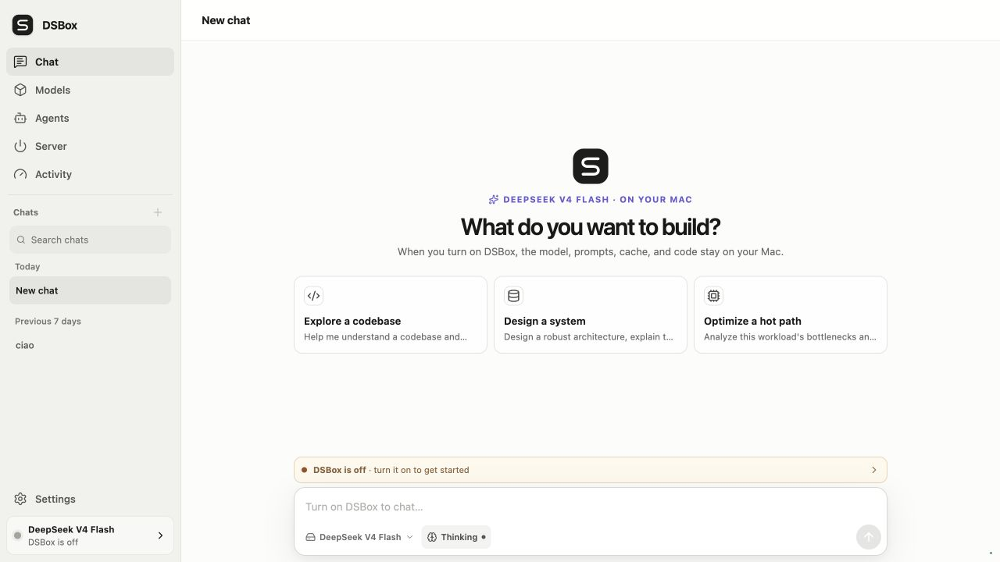
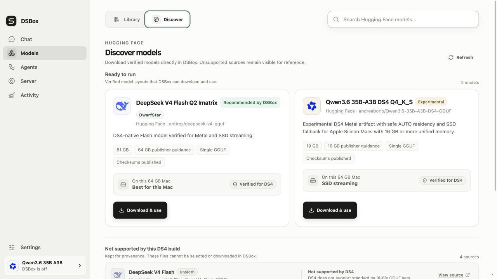
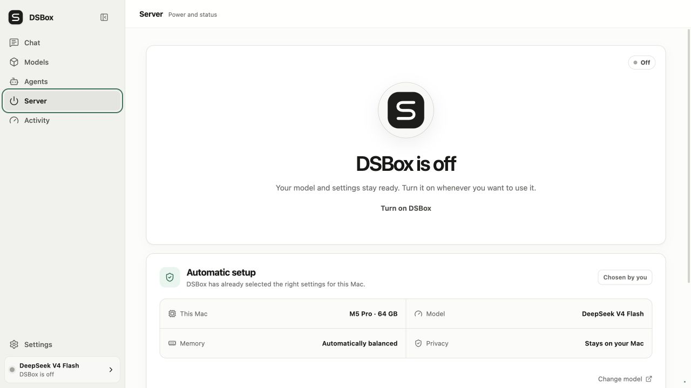
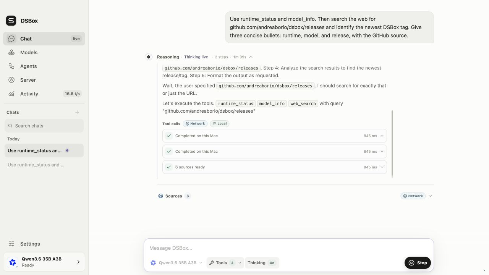
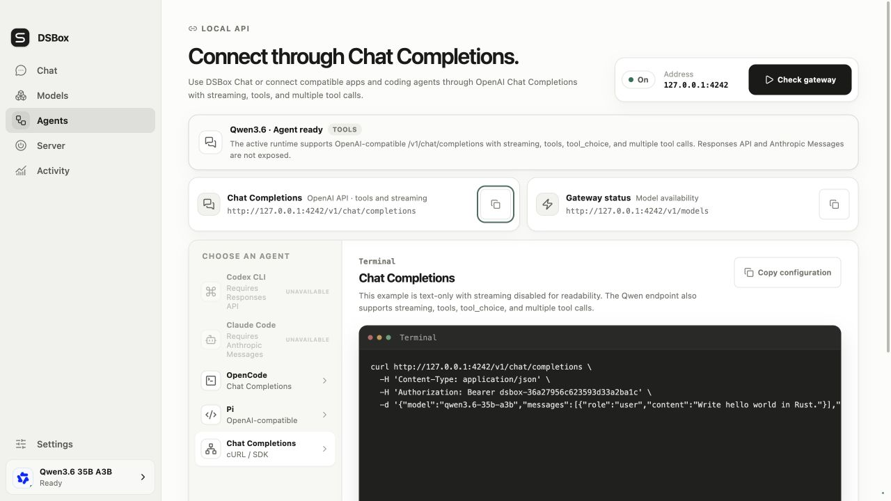
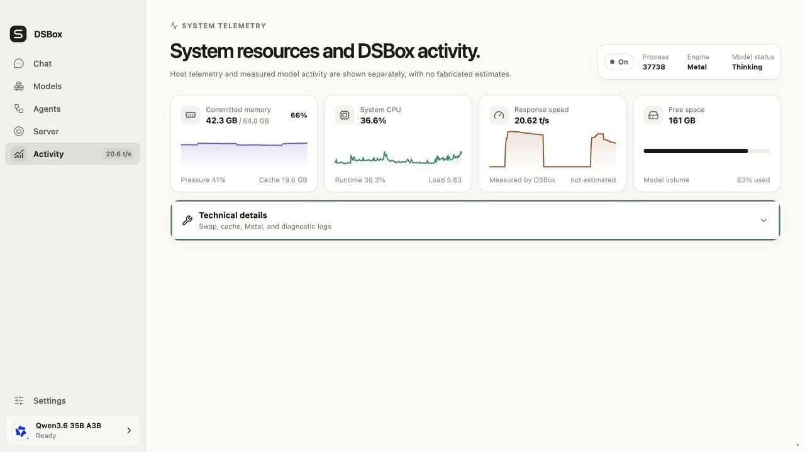
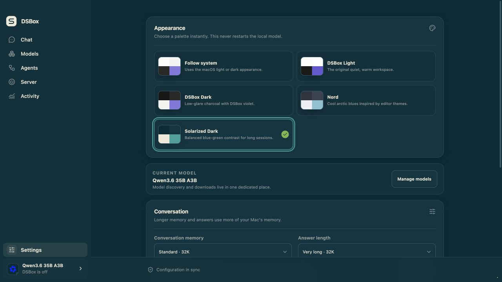
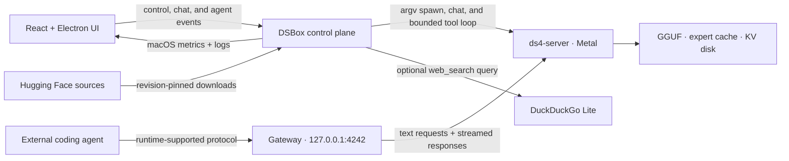

<p align="center">
  
</p>

<h1 align="center">DSBox</h1>

<p align="center"><strong>Your Mac. Your model. One switch.</strong></p>

<p align="center">
  A polished Apple Silicon desktop app for running
  <a href="https://github.com/andreaborio/ds4">andreaborio/ds4</a>
  with Metal AUTO residency, SSD streaming, local chat, coding-agent endpoints, and honest macOS telemetry.
</p>

<p align="center">
  <a href="https://github.com/andreaborio/dsbox/releases/latest"></a>
  <a href="https://github.com/andreaborio/dsbox/actions/workflows/ci.yml"></a>
  
  
  <a href="LICENSE"></a>
</p>

<p align="center">
  <a href="https://github.com/andreaborio/dsbox/releases/latest"><strong>Download for Apple Silicon</strong></a>
  · <a href="docs/INSTALL-macOS.md">Installation guide</a>
  · <a href="#run-from-source">Run from source</a>
</p>



<p align="center"><sub>Private local chat with persistent threads, syntax-highlighted code, model controls, and timings measured by DS4.</sub></p>

## Why DSBox

- **One power control.** Once a model is selected, DSBox can prepare the checkout, build `ds4-server`, validate flags, start it, and wait for real readiness.
- **Models without path hunting.** Scan the Mac, choose a GGUF with Finder, or review and download a Hugging Face variant inside DSBox.
- **SSD streaming with a qualified floor.** Release models require at least 64 GiB of unified memory; above that floor, DSBox can stream even when the GGUF is larger than RAM.
- **The right memory path automatically.** Qwen3.6 and DeepSeek delegate resident-or-SSD planning to DS4 AUTO; GLM-5.2 uses the same minimal startup and resolves to its qualified SSD-only path.
- **A complete local chat.** Threads, reasoning, stop control, automatic scrolling, syntax-highlighted code, one-click copy, and response-level prefill/generation timings.
- **A bounded agent loop.** Agent mode can inspect the local runtime and model, optionally search the web, and show reasoning, tool activity, results, and sources as they stream.
- **Bring your coding agent.** The Agents screen exposes model-aware loopback endpoints, copy-ready configurations, and honest unavailable states when the active runtime lacks a required protocol.
- **Editor-inspired palettes.** Follow macOS or switch instantly between DSBox Light, DSBox Dark, Nord, and Solarized Dark without restarting the model.
- **Telemetry that says what it knows.** Memory pressure, committed memory, swap, CPU, process RSS, disk, and generation speed are reported; unsupported GPU metrics remain `N/A`.

## Three steps

1. **Choose a model.** Use a validated GGUF already on the Mac or explicitly confirm an in-app catalog download.
2. **Turn on DSBox.** The Server screen prepares and launches DS4 with Metal and guarded automatic memory planning.
3. **Chat or connect an agent.** Use the built-in interface, or choose a client the active runtime actually supports; the Agents screen shows the available protocols.



<p align="center"><sub>Browse revision-pinned sources, compare hardware guidance, and keep unsupported layouts clearly separated.</sub></p>



<p align="center"><sub>One power surface prepares Metal, applies guarded automatic memory planning, and reports real readiness.</sub></p>

## Agentic chat and coding-agent connections

DSBox has two related agent surfaces, with a deliberately different owner for each loop:

| Surface | Who owns the agent loop | What DSBox provides |
| --- | --- | --- |
| **Agent mode in DSBox Chat** | DSBox | A bounded, streamed loop with visible reasoning, tool calls, results, timing, and sources. |
| **Agents screen** | The connected client | A stable loopback model gateway plus model-aware endpoints and copy-ready configuration. The client owns its tools, permissions, workspace access, and network policy. |

### Built-in Agent mode

DSBox enables Agent mode only after the active runtime advertises tool support through `/v1/models` or accepts a harmless capability probe. If support is unavailable or cannot be verified, chat falls back to standard local inference instead of pretending that tools work.

The current read-only tool registry is intentionally small:

- `runtime_status` reads DS4 lifecycle and inference activity on this Mac;
- `model_info` reads the model exposed by the active runtime;
- `web_search` sends a bounded query to DuckDuckGo Lite and returns source-labelled snippets.

Tool arguments are schema-validated before execution. One run is capped at eight tool rounds, eight calls per model turn, 24 calls overall, and three concurrent executions. Stop cancels active model and tool requests. Turning Web off blocks `web_search` in the executor before any network request; when it is on, only the normalized search query leaves the Mac and returned snippets are treated as untrusted source material.

The model-neutral loop works with supported Qwen3.6 and DeepSeek V4 Flash runtimes, but DSBox still serves one selected model at a time. This is not two-model orchestration. The built-in loop also does not currently get filesystem access, a shell, code-writing permissions, browser control, MCP, background runs, approvals, or sub-agents.



<p align="center"><sub>A bounded local loop with visible reasoning, local and network tool calls, explicit sources, and real timings.</sub></p>

### External coding agents

The **Agents** screen reads the selected runtime's actual protocol surface and disables incompatible clients. In the current Qwen3.6 path, OpenAI Chat Completions supports streaming, tools, `tool_choice`, and multiple tool calls; Responses and Anthropic Messages are not exposed, so Codex CLI and Claude Code are shown as unavailable while compatible clients such as OpenCode, Pi, and direct Chat Completions remain usable.



<p align="center"><sub>Connect compatible coding tools through a loopback gateway, with protocol limits shown for the active model instead of hidden.</sub></p>

## Themes and honest observability

Activity keeps host telemetry separate from measured model activity. It reports committed memory, memory pressure, cache, system and runtime CPU, disk space, runtime phase, and response speed from DS4. It does not invent unsupported GPU-utilization figures.



<p align="center"><sub>Live macOS resources and measured model throughput, shown separately and without fabricated estimates.</sub></p>

Appearance includes five instant choices: Follow system, DSBox Light, DSBox Dark, Nord, and Solarized Dark. They change the workspace without restarting the local model. These are curated built-in palettes inspired by editor themes, not a VS Code theme-file importer.



<p align="center"><sub>Switch between the original DSBox workspace and editor-inspired dark palettes without interrupting the runtime.</sub></p>

## Models, made transparent

### Use a GGUF already on the Mac

**Scan this Mac** checks Spotlight first and falls back to a bounded filesystem scan. Before adding a result, DSBox reads the GGUF v3 header, architecture metadata, and tensor index to verify that the file uses a layout supported by DS4. It never reads the model-weight payload during this check, so validation stays lightweight even for very large files. Verified findings are stored in `~/.dsbox/local-models.json` with user-only permissions, so the chat model switcher opens immediately instead of scanning the disk again. Deleted, unreadable, corrupt, multipart, or incompatible entries are pruned automatically.

**Choose GGUF file…** opens the native Finder picker. DSBox uses the selected model in place: it does not copy or upload it, and it never asks a non-technical user to type a path.

A generic GGUF container is not enough: DS4 requires its own architecture metadata and tensor layout. Finder selection, disk scan, model switching, and server startup all use the same compatibility gate, with a specific explanation when a file cannot run. Qwen3.6, DeepSeek V4 Flash, and GLM-5.2 inference now require the opaque `ds4.expert_major.v2` store. Canonical routed tensors and the retired `ds4.expert_major.v1` layout are rejected, so the Library never presents them as runnable or portable llama.cpp/MLX GGUFs.

### Download inside DSBox

The catalog reads DS4-oriented sources from the Hugging Face `andreaborio` profile. Every installable Qwen, DeepSeek, or GLM model must have a revision-pinned `dsbox.json` declaring ExpertMajor v2, `ds4.expert_major.v2`, the required `andreaborio/ds4` `main` runtime, an exact runtime commit, and one complete GGUF whose byte size and SHA-256 match Hugging Face LFS metadata. DSBox enables download only when that complete contract is present, then verifies and builds the unified runtime before the download starts. Each public family repository may retain canonical, v1, chunked, or sidecar files for download continuity and reproducibility, but its root manifest selects only the v2 file and DSBox marks every other variant unavailable. Canonical inference, old GLM sidecars, and legacy runtime branches are not compatibility targets. Unsloth repositories remain visible for provenance, but their standard GGUF builds cannot be selected or downloaded.

A renamed model repository can declare `previousRepositories` in the same manifest. DSBox uses those ids only to recognize an already-installed bundle at its old local path; new downloads always use the current revision-pinned repository.

Downloads are:

- explicitly confirmed—turning on the server never silently starts one;
- pinned to a Hugging Face revision;
- resumable after interruption;
- staged and committed atomically;
- size-verified, with SHA-256 verification when the source publishes it;
- enabled only when the model layout and runtime contract are explicitly verified for DS4.

Recommendations are made by **DSBox**, never presented as an endorsement from Andrea Borio or Unsloth.

### Switch models from chat

Installed inventory models appear beside the Thinking control. If DS4 is off, a selection applies to the next start. If it is running, DSBox validates the replacement first, restarts the server, and attempts to restore the previous model and runtime if the new launch fails. Switching is disabled while a generation, download, or conflicting runtime operation is active.

## Install the macOS app

DSBox ships as an arm64 Electron app for macOS 13 or later.

1. Download `DSBox-<version>-macOS-arm64.dmg` and `SHA256SUMS.txt` from the [latest release](https://github.com/andreaborio/dsbox/releases/latest).
2. Verify the download from the same folder:

   ```sh
   shasum -a 256 -c SHA256SUMS.txt
   ```

3. Open the DMG and drag **DSBox** to **Applications**.
4. The community build is ad-hoc signed but not notarized. On first launch, Control-click **DSBox**, choose **Open**, then confirm **Open**.

The checksum-first Gatekeeper and “app is damaged” recovery flow is documented in [`docs/INSTALL-macOS.md`](docs/INSTALL-macOS.md). Only bypass quarantine for an artifact whose checksum you have verified.

There is no automatic app updater yet. Upgrade by quitting DSBox and replacing the application with the newer DMG; models, configuration, downloads, and local threads live outside the app bundle.

## Run from source

Requirements: Apple Silicon, macOS 13+, Node.js 22+, Xcode Command Line Tools, and enough free SSD space for the selected model.

```sh
xcode-select --install
git clone https://github.com/andreaborio/dsbox.git
cd dsbox
./start.command
```

`start.command` installs JavaScript dependencies, builds the UI, starts the loopback control plane, and opens DSBox. For development:

```sh
npm ci
npm run dev
```

- UI: `http://127.0.0.1:5173`
- Gateway and control plane: `http://127.0.0.1:4242`

## Coding-agent endpoint reference

The public loopback gateway stays stable even if the internal DS4 port changes. Route availability still follows the selected DS4 runtime; the **Agents** screen is the source of truth for what can be used now.

| Protocol | Endpoint | Availability |
| --- | --- | --- |
| OpenAI Chat | `http://127.0.0.1:4242/v1/chat/completions` | Supported by the current Qwen3.6 path, including streaming and tools. |
| OpenAI Responses | `http://127.0.0.1:4242/v1/responses` | Only when the selected runtime exposes Responses; current Qwen3.6 does not. |
| Anthropic Messages | `http://127.0.0.1:4242/v1/messages` | Only when the selected runtime exposes Anthropic Messages; current Qwen3.6 does not. |
| Model discovery | `http://127.0.0.1:4242/v1/models` | Reports the model and capabilities exposed by the active runtime. |

The **Agents** screen generates configurations using the currently selected model and gateway settings. If gateway authentication is enabled, copy the real key from Settings instead of using a placeholder.

When the Agents screen marks Codex CLI as available, an example provider is:

```toml
[model_providers.ds4]
name = "DS4 local"
base_url = "http://127.0.0.1:4242/v1"
wire_api = "responses"
stream_idle_timeout_ms = 1000000
```

Then use the model ID shown by DSBox:

```sh
codex --model <selected-model-id> -c model_provider=ds4
```

## SSD streaming and safety

DSBox does not pretend that “fits on SSD” means “will be fast.” ExpertMajor v2 release models require at least 64 GiB of unified memory. On supported Macs, a model larger than unified memory may run through DS4 SSD streaming, but speed still depends on model structure, quantization, storage, thermal state, and cache warmth. Insufficient memory or disk space blocks installation.

Adaptive mode lets DS4 calculate its expert-cache budget from live model geometry and available memory. DSBox independently watches macOS pressure and swap activity while the runtime is active, and performs a safety stop if pressure becomes unsafe or required signals repeatedly disappear. Manual cache, residency, and power controls remain available only for unmanaged/custom runtimes. DeepSeek and GLM retain disk-KV; DeepSeek also retains imatrix and directional steering. Qwen keeps live context reuse but cannot serialize its recurrent session payload yet, while GLM keeps its graph-selected prefill schedule. Context, trace, safe extra flags, and environment controls remain available in Settings.

For Qwen3.6, DeepSeek V4 Flash, and GLM-5.2, DSBox requires the unified DS4
[`57acfd4`](https://github.com/andreaborio/ds4/commit/57acfd408a3154851a0c59be432904300abb3b6c)
ExpertMajor v2 runtime or newer. On the normal managed path, all three families
receive no backend, power, residency, streaming, cache, preload, or cold-start
override from DSBox. DS4 selects its validated AUTO plan from the model and live
memory state. DSBox keeps its independent one-second pressure and swapout watchdog
armed in every managed outcome.

<details>
<summary><strong>Recorded Qwen3.6 reference results</strong></summary>

On a MacBook Pro M5 Pro with 64 GB unified memory, the 19.38 GiB
`Qwen3.6-35B-A3B-DS4-ExpertMajor-v2-Q4_K_S.gguf` artifact ran fully resident on Metal. A
balanced six-run serial/parallel router A/B improved median generation from
37.00 to 62.96 t/s (+70.2%) with identical output hashes. Five quiet-desktop
confirmations measured median prefill at 223.73 t/s and generation at 65.63 t/s;
the same binary measured 50.20 t/s generation under active compositor and Codex
GPU contention. The optimized Thinking sampler improved a short-context A/B
from 39.71 to 58.59 t/s (+47.6%). At positions 1,428-1,628, parallel full-
attention GQA improved an adjacent A/B from 36.18 to 44.06 t/s (+21.8%) with an
identical response hash. A 504-token DSBox-like Thinking turn measured 320.30
t/s prefill and 41.04 t/s generation while its attention prefix grew from 1,426
to 1,930 tokens. These changes schedule sampling and attention more efficiently;
they do not change or further quantize model weights. Every recorded process
reported zero swaps. A final active-desktop parity check measured 46.61 versus
46.54 t/s at short context and 33.03 versus 33.19 t/s at a 1,403-token prefix
without/with Thinking, confirming that full-vocabulary sampling no longer adds
a material decode penalty. These are bounded machine-local measurements, not
guarantees for arbitrary prompts or foreground GPU load. During the v2 migration,
a controlled 2K-token A/B/A gate measured 318.83–318.96 t/s prefill and 29.54 t/s
decode on v2, with byte-identical output and less than one percent delta versus
the retired v1 container. The current release notes and methodology live in the
[`andreaborio/ds4`](https://github.com/andreaborio/ds4) repository.

</details>

<details>
<summary><strong>Recorded DeepSeek V4 Flash reference results</strong></summary>

The table below uses the 86.72 GB DeepSeek V4 Flash IQ2XXS/SExpQ8 GGUF and the immutable reference [`andreaborio/ds4@91e0f5d`](https://github.com/andreaborio/ds4/commit/91e0f5dc4dbf26280207b2ae642a9ff835bf488f). Short runs are highly sensitive to prompt length and macOS page-cache state; these are measurements, not hardware guarantees.

| Mac | Bounded workload | Generation throughput |
| --- | --- | ---: |
| M5 Pro, 64 GB | two DSBox API requests, 22–23 prompt + 64 output tokens | 9.88 / 12.86 t/s |
| M5 Pro, 64 GB | `ds4-bench`, 128 prompt + 64 decode tokens | 13.05 / 13.59 t/s |

</details>

## Privacy and current limits

- Inference, models, configuration, and thread history stay on the Mac. Threads use browser/Electron local storage; they are not encrypted or synchronized.
- The control plane and internal DS4 server bind to loopback only. Mutating control actions require a custom header, and optional Bearer/`x-api-key` gateway authentication is available.
- DSBox is currently text-only. Image, audio, video, and file parts are rejected before they can reach DS4.
- Web search is not fully offline. In Agent mode **Web on** is the default persistent preference, so the model can choose `web_search` without a per-message authorization step; the visible control is an explicit opt-out. Turning it off blocks the executor before any network request, including when an older web call remains in thread history. Standard chat separately routes explicit or clearly time-sensitive requests through the local search classifier. When enabled, a normalized query of at most 400 characters is sent to DuckDuckGo Lite, and search failure falls back to local inference.
- Metal utilization remains `N/A` because macOS does not expose a reliable per-process value without elevated tooling. DSBox does not use `sudo` or `powermetrics`.
- The community DMG is ad-hoc signed and not notarized. A fully trusted first launch requires Apple Developer ID signing and notarization.

## Architecture



The gateway parses and validates incoming requests, rejects unsupported media, removes hop-by-hop headers, and relays response status, safe headers, and streaming bytes. It does not translate semantic text, tool, or reasoning fields.

## Development and releases

```sh
npm run typecheck
npm test
npm run build
```

Build and verify the macOS artifacts:

```sh
npm run pack:mac
npm run dist:mac
npm run verify:mac
```

A version tag matching `package.json` runs the same checks on GitHub Actions and publishes the DMG, SHA-256 file, and installation guide.

## Security

Please report security issues privately to the repository owner. Do not expose DSBox or `ds4-server` directly on `0.0.0.0`; use an SSH tunnel for access from another machine.

## License

[MIT](LICENSE)
