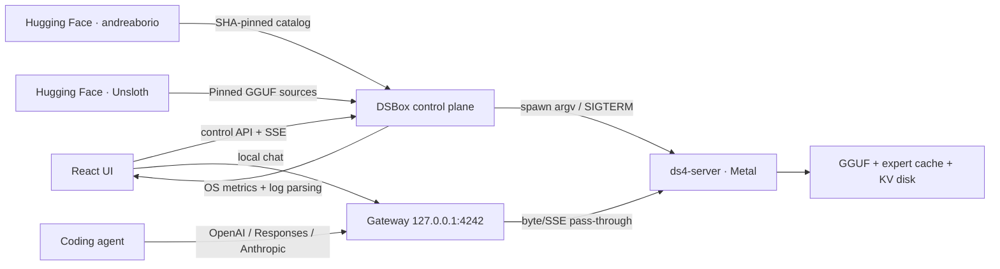

# DSBox

DSBox is a local client for running [andreaborio/ds4](https://github.com/andreaborio/ds4) on Apple Silicon. It turns building, Metal configuration, SSD streaming, resource monitoring, and coding-agent integration into a guided, one-click workflow.

The interface is intentionally focused: a ChatGPT-style chat, a single control for starting the server, settings editable from the UI, live logs, real Mac metrics, and ready-to-use snippets for Codex, Claude Code, OpenCode, Pi, and OpenAI-compatible clients. Users who do not want to manage technical details can keep the safe defaults.

## What is included

- conservative installation or updates of the fork, without overwriting local commits or changes;
- discovery of existing `andreaborio/ds4` checkouts on the Mac;
- native Metal build of `ds4-server`;
- one-click startup after a model has been selected: DSBox prepares the engine, model, and memory before starting the server;
- a multi-source model catalog for DS4 releases from `andreaborio` and relevant official Unsloth GGUF repositories;
- recommendations attributed exclusively to DSBox, never to the catalog author;
- graceful process startup and shutdown, with a real readiness check against `GET /v1/models`;
- RAM-aware context/output profiles with expert-cache sizing delegated to DS4's live hardware and model planner;
- an independent 1 Hz macOS pressure/swap watchdog for automatic cache profiles;
- adaptive 16/24 GB profiles that trade unused context allocation for a larger safe expert cache;
- a profile with an automatically calculated cache budget;
- UI controls for context, power, threads, prefill, KV disk, trace, imatrix, flags, and environment variables;
- a stable local gateway at `http://127.0.0.1:4242`;
- byte-stream pass-through for Chat Completions, Responses, and Anthropic Messages, including SSE;
- local chat with collapsible reasoning, navigation-safe streaming, and a global generation stop control;
- local-only thread history with new, switch, and delete controls stored in the browser on this Mac;
- per-response prompt/completion totals, prefill speed and duration, thinking time, average decode speed, and total time when the stream exposes usage data;
- a prompt-aware Web search skill with cancellable DuckDuckGo lookup, graceful local fallback, untrusted-result isolation, numbered sources, and no technical controls in the composer;
- 1 Hz monitoring for RAM, memory pressure, swap, CPU, process RSS, free SSD space, and throughput parsed from logs;
- no fabricated GPU metrics: Metal utilization remains `N/A` when macOS does not expose it without elevated privileges;
- persistent configuration in `~/.dsbox/config.json`.

## Quick start

Requirements:

- an Apple Silicon Mac;
- Node.js 22 or later;
- Xcode Command Line Tools for building ds4 (`xcode-select --install`);
- enough SSD space for the model and KV cache.

Double-click `start.command` in Finder, or run:

```sh
./start.command
```

On first launch, `start.command` installs the application dependencies, builds the UI, starts the loopback control plane, and opens the browser. Before turning on the server, choose either a compatible GGUF already stored on the Mac or a model from the DSBox catalog. Catalog downloads show their size and require explicit confirmation. DSBox never starts a model download merely because the power button was pressed.

Once a model is ready, start the local server with **Power on** in the top bar or with the main control on the **Server** screen.

For development:

```sh
npm ci
npm run dev
```

UI: `http://127.0.0.1:5173`

Local API: `http://127.0.0.1:4242`

## macOS app and DMG

DSBox also ships as a native Apple Silicon desktop app. The app embeds the control plane, opens a single sandboxed Electron window, and keeps the same stable loopback gateway at `127.0.0.1:4242`. If a compatible DSBox control plane is already running, the app attaches to it instead of starting a duplicate process.

### Install from the DMG

1. Download `DSBox-<version>-macOS-arm64.dmg` from the latest GitHub release, or use the file generated in `release/` when building locally.
2. Double-click the DMG to mount it.
3. Drag **DSBox** onto the **Applications** shortcut in the installer window.
4. Eject the **DSBox** disk image from Finder. Do not run the app permanently from the mounted DMG.
5. Open **Applications**, then double-click **DSBox**. The app opens its local control plane automatically; no Terminal command is required.

Official release builds should be signed and notarized. A local development DMG is unsigned, so macOS may block its first launch. Only if you built the app yourself or trust the exact artifact, try opening it once, then go to **System Settings → Privacy & Security**, scroll to **Security**, and choose **Open Anyway**. Apple documents this exception flow in [Open a Mac app by overriding security settings](https://support.apple.com/guide/mac-help/open-an-app-by-overriding-security-settings-mh40617/mac). Do not bypass the warning for an artifact you cannot verify.

After installation, follow **First-time setup** below. Updating DSBox uses the same process: quit the app, mount the newer DMG, and replace the existing copy in Applications. Models, configuration, and local chat data remain outside the application bundle.

### Build the DMG

Build the arm64 application bundle without a disk image:

```sh
npm run pack:mac
```

Build the drag-to-Applications DMG:

```sh
npm run dist:mac
```

Artifacts are written to `release/`. Local development builds are intentionally unsigned. Public distribution requires a Developer ID Application certificate and Apple notarization credentials to be configured in the packaging environment.

## First-time setup

1. Open DSBox from **Applications**, or use `start.command` when running directly from a source checkout.
2. Open **Models**, then either scan this Mac, choose a GGUF in Finder, or explicitly confirm a download from the **DSBox catalog**.
3. Wait until the model is shown as ready. Interrupted catalog downloads can resume from the point they reached.
4. Select **Power on** and wait for **DSBox is on**.

You do not need to choose a branch, calculate the cache size, or understand SSD streaming: DSBox bounds context and output length from unified-memory capacity, then leaves expert-cache sizing to DS4's live model geometry and macOS memory budget. This avoids hard-coding a cache count from one GGUF into another quantization. Automatic cache runs start only at normal memory pressure and are checked independently once per second; DSBox stops the runtime if pressure reaches warning, host-wide swapout grows by more than 1 MiB, or the safety signals cannot be read three times in a row. A safety stop escalates from a short `SIGTERM` grace to `SIGKILL`. Manual controls remain available in **Settings**, while checkout details, the effective command, and logs are grouped in the technical section.

The effective command is always available for inspection. The process is created from an `argv` array and never from a string passed to a shell.

### Measured SSD-streaming performance

The immutable benchmark reference is
[`andreaborio/ds4@91e0f5d`](https://github.com/andreaborio/ds4/commit/91e0f5dc4dbf26280207b2ae642a9ff835bf488f).
All rows use the 86.72 GB DeepSeek V4 Flash IQ2XXS/SExpQ8 GGUF on AC power,
without static-weight pinning. Short results are highly sensitive to workload
length and macOS page-cache state, so they are not hardware guarantees.

| Mac | Tested ds4 build and cache | Bounded workload | Generation throughput |
| --- | --- | --- | ---: |
| M1 Pro, 16 GB | `2f95e67`, exact 259, context 8,192 | DSBox API, 9 prompt + 2 output tokens | 0.30 t/s cold; 0.53 / 0.51 / 0.51 t/s warm (~0.52 t/s) |
| M5 Pro, 64 GB | `6aa496d`, AUTO 3,613, context 32,768 | two sequential DSBox API requests, 22–23 prompt + 64 output tokens | 9.88 / 12.86 t/s |
| M5 Pro, 64 GB | `f4e0e64`, AUTO 4,387, context 32,768 | `ds4-bench`, 128 prompt + 64 decode tokens | 13.05 / 13.59 t/s (13.3173 geomean) |
| M5 Pro, 64 GB | `f4e0e64`, exact 4,342 reference | same bounded ABBA comparison | 13.74 / 13.78 t/s (13.7600 geomean) |

The exact M5 reference was 3.32% faster than AUTO, with identical frontier
logits and zero new swapout, but DSBox deliberately keeps the generic default
on DS4 AUTO so cache size follows the actual GGUF and live host budget. The M1
server row is historical: `2f95e67` was reverted because its startup bridge
could admit too little sustained headroom. A separate extremely hot two-token
CLI micro-canary reached 2.13–2.46 t/s; it is not representative of sustained
DSBox service and is not used as the headline result.

In the current M5 service-path canary, lower live headroom made AUTO choose
3,613 experts / 23.82 GiB. Both 64-token requests kept macOS pressure normal
and added zero swapout; the second, warmer but different prompt reached
12.86 t/s.

## Models: local files and the DSBox catalog

The model picker presents two explicit choices at the same level:

- **Scan this Mac** uses Spotlight first, then a bounded filesystem search, to find GGUF files on indexed and accessible drives.
- **Choose GGUF file…** opens the native Finder picker and uses the selected file in place without asking for a path, copying it, or uploading it.
- **Download from the DSBox catalog** shows the download size, destination, and model status before asking for confirmation.

DSBox searches for future optimized models among public repositories tagged `ds4` under the Hugging Face [`andreaborio`](https://huggingface.co/andreaborio/models) profile. It also surfaces the official Unsloth GGUF repositories for [DeepSeek V4 Flash](https://huggingface.co/unsloth/DeepSeek-V4-Flash-GGUF) and [GLM 5.2](https://huggingface.co/unsloth/GLM-5.2-GGUF) as a separate source. Unsloth repositories can contain many large, sharded quantizations, so DSBox asks the user to choose the exact variant on Hugging Face and then select its first GGUF shard locally; it does not guess a quantization or start a download.

Publisher names identify only where files are hosted. They do not imply that Andrea Borio or Unsloth recommends a model for DSBox. A recommendation is shown only when the independent DSBox catalog policy grants the **Recommended by DSBox** badge.

When a model passes the catalog policy, the interface displays the **Recommended by DSBox** badge. The recommendation always comes from DSBox, regardless of the repository author. To qualify for the curated catalog path, a model must:

- publish a `dsbox.json` manifest with `schemaVersion: 1`;
- declare `status: "stable"` and be eligible under the DSBox recommendation policy;
- provide a single installable GGUF file;
- publish the GGUF LFS SHA-256 checksum;
- be compatible with the Mac's unified memory and the selected DS4 channel;
- not be marked as experimental.

The model currently available on the profile, [`andreaborio/glm52-ds4-native-64g-q2k-experimental`](https://huggingface.co/andreaborio/glm52-ds4-native-64g-q2k-experimental), is an experimental multipart artifact intended for advanced testing. DSBox therefore excludes it from the curated default path and does not present it as recommended. If the catalog has no eligible model, DSBox asks the user to select a compatible local GGUF; it does not silently start the fork's `q2-imatrix` download.

You can always select your own GGUF from **Models**. DSBox validates the GGUF container and multipart completeness before selection; engine-layout compatibility is not claimed unless it is declared by verified model metadata. A local file does not automatically receive a recommendation badge and does not alter the DSBox catalog.

### `dsbox.json` manifest v1

A minimal example is available at [`docs/dsbox-manifest-v1.json`](docs/dsbox-manifest-v1.json). The file must be located at the root of the model repository. DSBox reads the manifest, metadata, and download from the same pinned Git revision so that validated content cannot change during installation.

| Field | Meaning |
| --- | --- |
| `schemaVersion` | Must be `1`. Unknown versions are ignored. |
| `name`, `description` | Text displayed in the catalog. |
| `status` | Only `stable` is eligible for the curated catalog path. |
| `recommended` | Marks a candidate for the DSBox recommendation policy; it is not displayed as an endorsement by the repository author. |
| `file` | Exact path to a single `.gguf` file in the repository. |
| `modelId` | ID exposed to OpenAI and Anthropic clients; required for catalog installation. |
| `runtimeBranch` | Branch of the DS4 fork required by the model, for example `main`; required for catalog installation. |
| `runtimeCommit` | Minimum complete Git commit from the fork; DSBox updates and rebuilds a clean checkout before downloading. |
| `minimumMemoryGb` | Minimum unified memory; required for catalog installation. |

The manifest describes an artifact. It cannot inject shell commands, environment variables, or arbitrary flags into the startup process.

## Fork channels

The two channels are not interchangeable:

| Channel | Model | Status |
| --- | --- | --- |
| `main` | DeepSeek V4 Flash / PRO | default |
| `codex/glm52-upstream-clean-bench` | GLM 5.2 | experimental |

Do not use the GLM branch for DeepSeek: the fork documents a decode regression on that line. For GLM, read the model ID from `/v1/models` (`glm-5.2`, `glm-5.2-chat`, or `glm-5.2-reasoner`), and ensure that the GGUF uses the layout expected by the fork.

DSBox validates every configured flag against `ds4-server --help all` before spawning the process. A flag available only on another branch produces a readable error instead of an ambiguous startup failure.

## Coding agents

The DSBox gateway remains stable even when the internal ds4 port changes:

| Protocol | Base URL | Primary endpoint |
| --- | --- | --- |
| OpenAI Chat | `http://127.0.0.1:4242/v1` | `/chat/completions` |
| OpenAI Responses / Codex | `http://127.0.0.1:4242/v1` | `/responses` |
| Anthropic / Claude Code | `http://127.0.0.1:4242` | `/v1/messages` |
| Discovery | `http://127.0.0.1:4242/v1` | `/models` |

Codex CLI example:

```toml
[model_providers.ds4]
name = "DS4 local"
base_url = "http://127.0.0.1:4242/v1"
wire_api = "responses"
stream_idle_timeout_ms = 1000000
```

If you enable **Require API key** for the gateway, also add `env_key = "DSBOX_API_KEY"` to the provider and export that variable before starting Codex. Without `env_key` and `requires_openai_auth`, Codex correctly treats the local provider as unauthenticated.

```sh
codex --model deepseek-v4-flash -c model_provider=ds4
```

Claude Code example:

```sh
export ANTHROPIC_BASE_URL=http://127.0.0.1:4242
export ANTHROPIC_AUTH_TOKEN=dsbox-local
export ANTHROPIC_MODEL=deepseek-v4-flash
```

The **Agents** screen generates complete snippets using the current URLs, model ID, context, output limit, and API key.

## Architecture



By default, `ds4-server` listens only on `127.0.0.1:8000`. The gateway does not modify JSON, reasoning, or tool calls; it forwards status codes, headers, and streams to preserve compatibility with the fork.

The runtime uses a single graph worker, so concurrent requests are serialized. DSBox does not claim batching or parallelism that ds4 does not implement.

### Activity indicator

The DSBox core uses a small animated SVG to make the real runtime state visible: preparing, prefill, thinking, decode, ready, or error. Events arrive from the gateway even when a request originates from an external coding agent rather than the built-in chat. The indicator remains still when there is no work, respects `prefers-reduced-motion`, and does not use WebGL, canvas, or the GPU.

## Security and privacy

- The control plane rejects non-loopback binding.
- The internal ds4 server is always started with `--host 127.0.0.1`.
- Mutating `/api/*` actions require a custom header, preventing an external web page from starting or stopping the runtime through a CSRF form.
- The gateway can require a Bearer token or `x-api-key`; the key can remain disabled in loopback mode.
- DSBox does not enable `--cors` on ds4.
- The UI does not load scripts, fonts, or assets from a CDN.
- Web search is automatic and intentionally has no composer setting. A conservative local router enables it only for explicit search requests or clearly time-sensitive prompts. Inference and thread storage remain local, and an unavailable search falls back to local inference.
- `--trace` is disabled by default because traces can contain prompts, outputs, and tool calls in plain text.
- The on-disk KV cache can contain prompt text; DSBox creates it with user-only permissions and does not delete it automatically.
- No command uses `sudo` or `powermetrics`.

For access from another computer, use an SSH tunnel. Never expose `ds4-server` or the control plane directly on `0.0.0.0`.

## Flags available in the UI

Base profile:

- `--metal`
- `--ssd-streaming`
- `--ssd-streaming-cache-experts NGB`
- `--ssd-streaming-cold`
- `--ssd-streaming-preload-experts N`
- `--ctx`, `--tokens`, `--threads`, `--power`
- `--prefill-chunk`, `--quality`, `--warm-weights`
- `--kv-disk-dir`, `--kv-disk-space-mb`
- `--kv-cache-min-tokens`, `--kv-cache-continued-interval-tokens`
- `--trace`
- `--imatrix-out`, `--imatrix-every` when available on the selected branch.

The **Advanced** section accepts additional flags and `KEY=value` lines. Quotes are tokenized, but no shell interpretation occurs. Flags not exposed by the selected binary are rejected before startup.

## Monitoring

Verified metrics:

- committed unified memory, calculated from non-purgeable anonymous pages, wired memory, and physical compressor usage reported by `vm_stat`;
- reusable file cache shown separately rather than being conflated with memory under genuine pressure;
- memory pressure and kernel level (`normal`, `warning`, `critical`) from `memory_pressure -Q` and `kern.memorystatus_vm_pressure_level`;
- swap from `sysctl vm.swapusage`;
- system CPU usage;
- CPU usage and RSS for the ds4 PID from `ps`;
- free volume space from `statfs`;
- tokens per second parsed from ds4 decode log lines.

The following are unavailable without additional instrumentation:

- cross-process Metal GPU utilization;
- per-process SSD throughput;
- continuous routed-expert cache hit rate.

These values remain `N/A` instead of being estimated.

## Testing and building

```sh
npm run typecheck
npm test
npm run build
```

Tests cover configuration, safe argument tokenization, 64/128 GB presets, loopback constraints, the revision-pinned catalog, experimental-model filtering, explicit model selection, one-click startup, the control-plane API, and SSE pass-through with prefill keepalive.

## Current limitations

- This initial version is a web-first local application launched through `start.command`; a signed and notarized `.app` release is future work.
- DSBox builds the fork on the Mac. A public distribution should pin a SHA and download a signed Metal bundle with checksums and rollback support.
- The one-click catalog installs only artifacts containing a single GGUF. Multipart repositories, including the current experimental GLM model, still require a manual procedure.
- Catalog downloads are resumable and pinned to a revision; DSBox does not convert or automatically join GGUF files.
- Normal shutdown uses SIGTERM and gives ds4 time to drain the request and save KV state. Force stop is a separate action and can lose the latest checkpoint.

## License

DSBox is distributed under the MIT License. `andreaborio/ds4`, the models, and their dependencies retain their own licenses.
