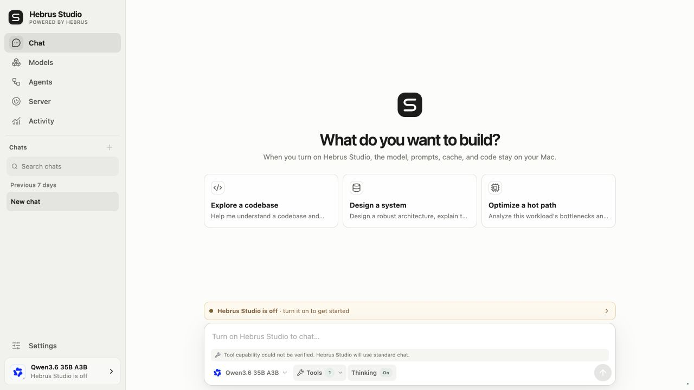
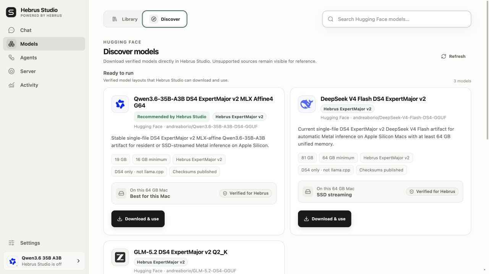
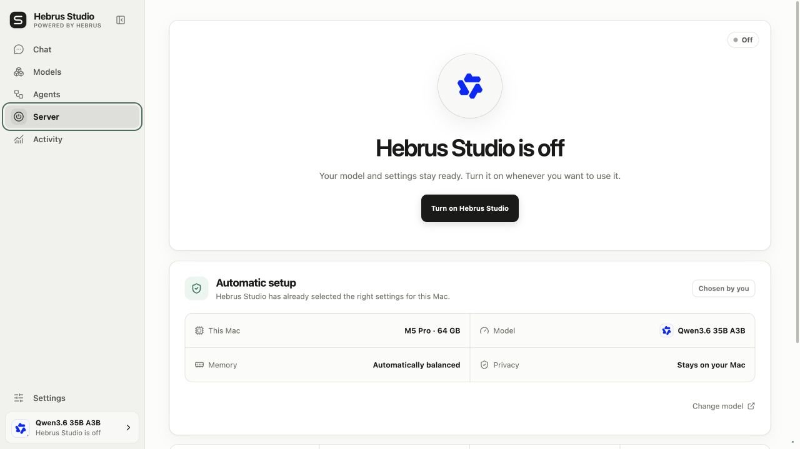
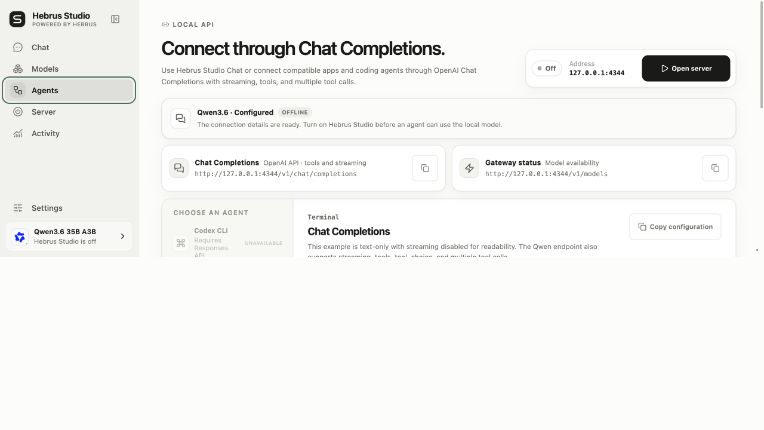
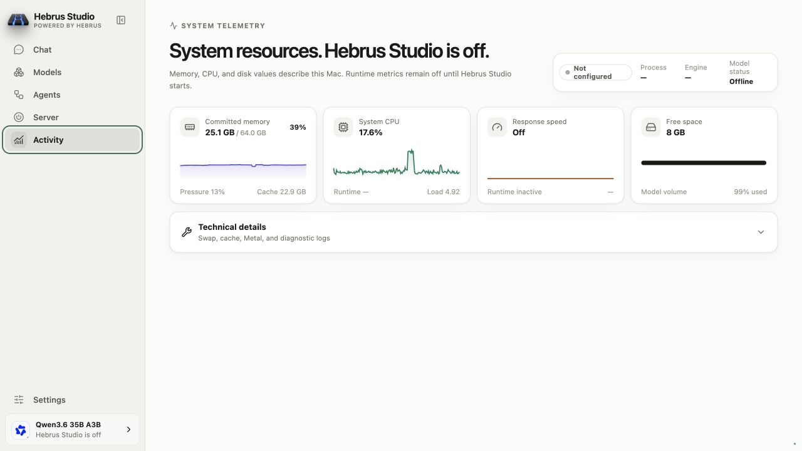
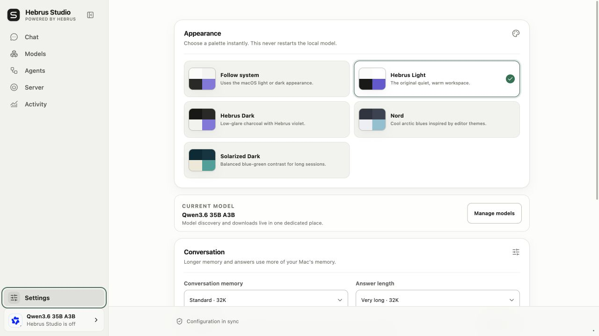
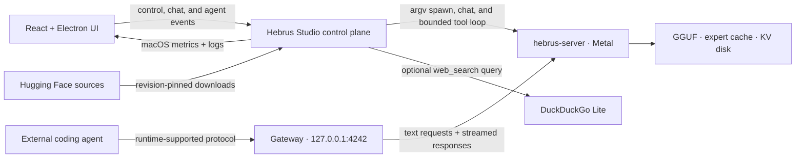

<p align="center">
  
</p>

<h1 align="center">Hebrus Studio</h1>

<p align="center"><strong>Your Mac. Your model. One switch.</strong></p>

<p align="center">
  The open desktop studio for <strong>Hebrus</strong>: Metal-first local inference,
  SSD streaming, private chat, coding-agent endpoints, and honest macOS telemetry.
</p>

> **Rename compatibility.** Hebrus Studio is the new public name of DSBox. The
> bundle identifier (`com.dsbox.desktop`), state root (`~/.dsbox`), `DSBOX_*`
> environment variables, local-storage keys, and legacy engine aliases remain
> unchanged in the bridge release so existing installs can upgrade safely.

<p align="center">
  
  <a href="https://github.com/andreaborio/hebrus-studio/actions/workflows/ci.yml"></a>
  
  
  <a href="LICENSE"></a>
</p>

<p align="center">
  <strong>Hebrus Studio 0.4.0 release candidate</strong>
  · <a href="docs/PACKAGING-macOS.md">Packaging status</a>
  · <a href="docs/INSTALL-macOS.md">Installation guide</a>
  · <a href="#run-from-source">Run from source</a>
</p>

> **Public release blocked by policy.** Version 0.4.0 is a release candidate,
> not an announced binary release. The machine-readable
> [`public-release-readiness.json`](scripts/public-release-readiness.json)
> intentionally has pending external gates, and the tag workflow refuses to
> build or publish while any remain. The final launch commit will restore the
> public release URL and download CTA only after strict readiness passes.



<p align="center"><sub>Private local chat with persistent threads, syntax-highlighted code, model controls, and timings measured by Hebrus.</sub></p>

## Why Hebrus Studio

- **One power control.** Once a model is selected, Hebrus Studio can prepare the checkout, build `hebrus-server` (or the legacy `ds4-server` alias), validate flags, start it, and wait for real readiness.
- **Models without path hunting.** Scan the Mac, choose a GGUF with Finder, or review and download a Hugging Face variant inside Hebrus Studio.
- **SSD streaming with qualified floors.** Qwen's qualified AUTO policy starts at 16 GiB; current DeepSeek and GLM releases require 64 GiB. Hebrus can stream when the GGUF is larger than RAM, subject to each model contract.
- **The right memory path automatically.** Qwen3.6 and DeepSeek delegate resident-or-SSD planning to Hebrus AUTO; GLM-5.2 uses the same minimal startup and resolves to its qualified SSD-only path.
- **A complete local chat.** Threads, reasoning, stop control, automatic scrolling, syntax-highlighted code, one-click copy, and response-level prefill/generation timings.
- **A bounded agent loop.** Agent mode can inspect the local runtime and model, optionally search the web, and show reasoning, tool activity, results, and sources as they stream.
- **Bring your coding agent.** The Agents screen exposes model-aware loopback endpoints, copy-ready configurations, and honest unavailable states when the active runtime lacks a required protocol.
- **Editor-inspired palettes.** Follow macOS or switch instantly between Hebrus Light, Hebrus Dark, Nord, and Solarized Dark without restarting the model.
- **Telemetry that says what it knows.** Memory pressure, committed memory, swap, CPU, process RSS, disk, and generation speed are reported; unsupported GPU metrics remain `N/A`.

## Three steps

1. **Choose a model.** Use a validated GGUF already on the Mac or explicitly confirm an in-app catalog download.
2. **Turn on Hebrus Server.** The Server screen prepares and launches Hebrus with Metal and guarded automatic memory planning.
3. **Chat or connect an agent.** Use the built-in interface, or choose a client the active runtime actually supports; the Agents screen shows the available protocols.



<p align="center"><sub>Browse revision-pinned sources, compare hardware guidance, and keep unsupported layouts clearly separated.</sub></p>



<p align="center"><sub>One power surface prepares Metal, applies guarded automatic memory planning, and reports real readiness.</sub></p>

## Agentic chat and coding-agent connections

Hebrus Studio has two related agent surfaces, with a deliberately different owner for each loop:

| Surface | Who owns the agent loop | What Hebrus Studio provides |
| --- | --- | --- |
| **Agent mode in Hebrus Studio Chat** | Hebrus Studio | A bounded, streamed loop with visible reasoning, tool calls, results, timing, and sources. |
| **Agents screen** | The connected client | A stable loopback model gateway plus model-aware endpoints and copy-ready configuration. The client owns its tools, permissions, workspace access, and network policy. |

### Built-in Agent mode

Hebrus Studio enables Agent mode only after the active runtime advertises tool support through `/v1/models` or accepts a harmless capability probe. If support is unavailable or cannot be verified, chat falls back to standard local inference instead of pretending that tools work.

The current read-only tool registry is intentionally small:

- `runtime_status` reads Hebrus lifecycle and inference activity on this Mac;
- `model_info` reads the model exposed by the active runtime;
- `web_search` sends a bounded query to DuckDuckGo Lite and returns source-labelled snippets.

Tool arguments are schema-validated before execution. One run is capped at eight tool rounds, eight calls per model turn, 24 calls overall, and three concurrent executions. Stop cancels active model and tool requests. Turning Web off blocks `web_search` in the executor before any network request; when it is on, only the normalized search query leaves the Mac and returned snippets are treated as untrusted source material.

The model-neutral loop works with supported Qwen3.6 and DeepSeek V4 Flash runtimes, but Hebrus Studio still serves one selected model at a time. This is not two-model orchestration. The built-in loop also does not currently get filesystem access, a shell, code-writing permissions, browser control, MCP, background runs, approvals, or sub-agents.

### External coding agents

The **Agents** screen reads the selected runtime's actual protocol surface and disables incompatible clients. In the current Qwen3.6 path, OpenAI Chat Completions supports streaming, tools, `tool_choice`, and multiple tool calls; Responses and Anthropic Messages are not exposed, so Codex CLI and Claude Code are shown as unavailable while compatible clients such as OpenCode, Pi, and direct Chat Completions remain usable.



<p align="center"><sub>Connect compatible coding tools through a loopback gateway, with protocol limits shown for the active model instead of hidden.</sub></p>

## Themes and honest observability

Activity keeps host telemetry separate from measured model activity. It reports committed memory, memory pressure, cache, system and runtime CPU, disk space, runtime phase, and response speed from Hebrus. It does not invent unsupported GPU-utilization figures.



<p align="center"><sub>Live macOS resources and measured model throughput, shown separately and without fabricated estimates.</sub></p>

Appearance includes five instant choices: Follow system, Hebrus Light, Hebrus Dark, Nord, and Solarized Dark. They change the workspace without restarting the local model. These are curated built-in palettes inspired by editor themes, not a VS Code theme-file importer.



<p align="center"><sub>Switch between the original Hebrus Studio workspace and editor-inspired dark palettes without interrupting the runtime.</sub></p>

## Models, made transparent

### Use a GGUF already on the Mac

**Scan this Mac** checks Spotlight first and falls back to a bounded filesystem scan. Before adding a result, Hebrus Studio reads the GGUF v3 header, architecture metadata, and tensor index to verify that the file uses a layout supported by Hebrus. It does not read model weights; for Qwen it additionally probes the fixed 168-byte ExpertMajor manifest prefix so the retired GGML/Q4 payload is rejected before launch. Validation therefore stays lightweight even for very large files. Verified findings are stored in `~/.dsbox/local-models.json` with user-only permissions, so the chat model switcher opens immediately instead of scanning the disk again. Deleted, unreadable, corrupt, multipart, or incompatible entries are pruned automatically.

**Choose GGUF file…** opens the native Finder picker. Hebrus Studio uses the selected model in place: it does not copy or upload it, and it never asks a non-technical user to type a path.

A generic GGUF container is not enough: Hebrus requires its own architecture metadata and tensor layout. Finder selection, disk scan, model switching, and server startup all use the same compatibility gate, with a specific explanation when a file cannot run. Qwen3.6, DeepSeek V4 Flash, and GLM-5.2 inference require the opaque `ds4.expert_major.v2` store; Qwen specifically requires its MLX affine4/group-64 payload inside that same v2 GGUF. Canonical routed tensors, Qwen v2 GGML/Q4 payloads, and the retired `ds4.expert_major.v1` layout are rejected.

### Download inside Hebrus Studio

The catalog reads Hebrus-oriented sources from the Hugging Face `andreaborio` profile. Every installable Qwen, DeepSeek, or GLM model must have a revision-pinned `dsbox.json` declaring ExpertMajor v2, `ds4.expert_major.v2`, the required `andreaborio/ds4` `main` runtime, an exact runtime commit, and one complete GGUF whose byte size and SHA-256 match Hugging Face LFS metadata. Qwen manifests must additionally declare `storage: mlx-affine4` and `groupSize: 64`. Hebrus Studio enables download only when that complete contract is present, then verifies and builds the unified runtime before the download starts. Canonical, v1, Qwen Q4, chunked, and sidecar artifacts remain non-runnable history rather than fallback formats.

A renamed model repository can declare `previousRepositories` in the same manifest. Hebrus Studio uses those ids only to recognize an already-installed bundle at its old local path; new downloads always use the current revision-pinned repository.

Downloads are:

- explicitly confirmed—turning on the server never silently starts one;
- pinned to a Hugging Face revision;
- resumable after interruption;
- staged and committed atomically;
- size-verified, with SHA-256 verification when the source publishes it;
- enabled only when the model layout and runtime contract are explicitly verified for Hebrus.

Recommendations are made by **Hebrus Studio**, never presented as an endorsement from Andrea Borio or Unsloth.

### Switch models from chat

Installed inventory models appear beside the Thinking control. If Hebrus is off, a selection applies to the next start. If it is running, Hebrus Studio validates the replacement first, restarts the server, and attempts to restore the previous model and runtime if the new launch fails. Switching is disabled while a generation, download, or conflicting runtime operation is active.

## macOS release candidate

Hebrus Studio 0.4.0 is being prepared as an arm64 Electron app for macOS 13 or
later. This README intentionally does not link a public binary while release
readiness is blocked; an older repository release may still carry the previous
product identity and must not be presented as the Hebrus Studio launch.

Release reviewers can inspect the local [packaging contract](docs/PACKAGING-macOS.md)
and [installation procedure](docs/INSTALL-macOS.md). Once every public-release
gate is evidenced and strict mode passes, the launch commit will add the exact
release URL and these checksum-first installation steps:

1. Obtain the approved `Hebrus-Studio-<version>-macOS-arm64.dmg` and
   `SHA256SUMS.txt` from the same public release.
2. Verify both from the same folder:

   ```sh
   shasum -a 256 -c SHA256SUMS.txt
   ```

3. Open the DMG and drag **Hebrus Studio** to **Applications**.
4. Confirm that macOS identifies the published app as Developer ID signed and
   notarized. Public release readiness cannot pass without both checks.

The checksum-first verification flow is documented in
[`docs/INSTALL-macOS.md`](docs/INSTALL-macOS.md). A Gatekeeper rejection is a
release failure; the public instructions do not ask users to bypass it.

There is no automatic app updater yet. When upgrading from DSBox, quit the old
app first: Finder will not replace `DSBox.app` with the differently named
`Hebrus Studio.app`. Install and verify Hebrus Studio, never run both bundles at
the same time, then remove DSBox or retain it offline only for rollback. Models,
configuration, downloads, Electron data, and local threads remain at their
legacy locations. See the [installation guide](docs/INSTALL-macOS.md).

## Run from source

Requirements: Apple Silicon, macOS 13+, Node.js 22+, Xcode Command Line Tools, and enough free SSD space for the selected model.

```sh
xcode-select --install
git clone https://github.com/andreaborio/hebrus-studio.git
cd hebrus-studio
./start.command
```

`start.command` installs JavaScript dependencies, builds the UI, starts the loopback control plane, and opens Hebrus Studio. For development:

```sh
npm ci
npm run dev
```

- UI: `http://127.0.0.1:5173`
- Gateway and control plane: `http://127.0.0.1:4242`

## Coding-agent endpoint reference

The public loopback gateway stays stable even if the internal Hebrus port changes. Route availability still follows the selected Hebrus runtime; the **Agents** screen is the source of truth for what can be used now.

| Protocol | Endpoint | Availability |
| --- | --- | --- |
| OpenAI Chat | `http://127.0.0.1:4242/v1/chat/completions` | Supported by the current Qwen3.6 path, including streaming and tools. |
| OpenAI Responses | `http://127.0.0.1:4242/v1/responses` | Only when the selected runtime exposes Responses; current Qwen3.6 does not. |
| Anthropic Messages | `http://127.0.0.1:4242/v1/messages` | Only when the selected runtime exposes Anthropic Messages; current Qwen3.6 does not. |
| Model discovery | `http://127.0.0.1:4242/v1/models` | Reports the model and capabilities exposed by the active runtime. |

The **Agents** screen generates configurations using the currently selected model and gateway settings. If gateway authentication is enabled, copy the real key from Settings instead of using a placeholder.

When the Agents screen marks Codex CLI as available, an example provider is:

```toml
[model_providers.ds4]
name = "Hebrus local"
base_url = "http://127.0.0.1:4242/v1"
wire_api = "responses"
stream_idle_timeout_ms = 1000000
```

Then use the model ID shown by Hebrus Studio:

```sh
codex --model <selected-model-id> -c model_provider=ds4
```

## SSD streaming and safety

Hebrus Studio does not pretend that “fits on SSD” means “will be fast.” DeepSeek and GLM ExpertMajor v2 releases require at least 64 GiB of unified memory; Qwen's qualified AUTO policy starts at 16 GiB. On supported Macs, a model larger than unified memory may run through Hebrus SSD streaming, but speed still depends on model structure, quantization, storage, thermal state, and cache warmth. Insufficient memory or disk space blocks installation.

Adaptive mode lets Hebrus calculate its expert-cache budget from live model geometry and available memory. Hebrus Studio independently watches macOS pressure and swap activity while the runtime is active, and performs a safety stop if pressure becomes unsafe or required signals repeatedly disappear. Manual cache, residency, and power controls remain available only for unmanaged/custom runtimes. DeepSeek and GLM retain disk-KV; DeepSeek also retains imatrix and directional steering. Qwen keeps live context reuse but cannot serialize its recurrent session payload yet, while GLM keeps its graph-selected prefill schedule. Context, trace, safe extra flags, and environment controls remain available in Settings.

For Qwen3.6, DeepSeek V4 Flash, and GLM-5.2, Hebrus Studio requires the unified Hebrus
[`57acfd4`](https://github.com/andreaborio/ds4/commit/57acfd408a3154851a0c59be432904300abb3b6c)
ExpertMajor v2 runtime or newer. On the normal managed path, all three families
receive no backend, power, residency, streaming, cache, preload, or cold-start
override from Hebrus Studio. Hebrus selects its validated AUTO plan from the model and live
memory state. Hebrus Studio keeps its independent one-second pressure and swapout watchdog
armed in every managed outcome.

<details>
<summary><strong>Recorded Qwen3.6 reference results</strong></summary>

On a MacBook Pro M5 Pro with 64 GB unified memory, the 20,808,566,880-byte
`Qwen3.6-35B-A3B-DS4-ExpertMajor-v2-MLX-Affine4-G64.gguf` release runs through
the same flag-free AUTO command in resident and SSD modes. Final resident
prefill measured 1,661.18 t/s at 2K, 1,421.90 t/s at 8K, and 877.34 t/s at 32K.
Forced SSD qualification measured 551.57, 269.10, and 83.69 t/s respectively.
At 32K the adaptive macro scheduler read 16.875 GiB once (1.000x amplification),
72.2% less than the 60.776 GiB multi-tile control, while throughput changed by
-0.63%. A 128+16 generation lane produced identical resident/SSD greedy token
IDs; resident decode was 57.43 t/s and the deliberately cold 321-expert SSD lane
was 23.94 t/s. These are bounded machine-local measurements, not guarantees for
arbitrary prompts or foreground GPU load. The full methodology lives in the
[`andreaborio/ds4`](https://github.com/andreaborio/ds4) repository.

</details>

<details>
<summary><strong>Recorded DeepSeek V4 Flash reference results</strong></summary>

The table below uses the 86.72 GB DeepSeek V4 Flash IQ2XXS/SExpQ8 GGUF and the immutable reference [`andreaborio/ds4@91e0f5d`](https://github.com/andreaborio/ds4/commit/91e0f5dc4dbf26280207b2ae642a9ff835bf488f). Short runs are highly sensitive to prompt length and macOS page-cache state; these are measurements, not hardware guarantees.

| Mac | Bounded workload | Generation throughput |
| --- | --- | ---: |
| M5 Pro, 64 GB | two Hebrus Studio API requests, 22–23 prompt + 64 output tokens | 9.88 / 12.86 t/s |
| M5 Pro, 64 GB | `ds4-bench`, 128 prompt + 64 decode tokens | 13.05 / 13.59 t/s |

</details>

## Privacy and current limits

- Inference, models, configuration, and thread history stay on the Mac. Threads use browser/Electron local storage; they are not encrypted or synchronized.
- The control plane and internal Hebrus server bind to loopback only. Mutating control actions require a custom header, and optional Bearer/`x-api-key` gateway authentication is available.
- Hebrus Studio is currently text-only. Image, audio, video, and file parts are rejected before they can reach Hebrus.
- Web search is not fully offline. In Agent mode **Web on** is the default persistent preference, so the model can choose `web_search` without a per-message authorization step; the visible control is an explicit opt-out. Turning it off blocks the executor before any network request, including when an older web call remains in thread history. Standard chat separately routes explicit or clearly time-sensitive requests through the local search classifier. When enabled, a normalized query of at most 400 characters is sent to DuckDuckGo Lite, and search failure falls back to local inference.
- Metal utilization remains `N/A` because macOS does not expose a reliable per-process value without elevated tooling. Hebrus Studio does not use `sudo` or `powermetrics`.
- Local development DMGs are ad-hoc signed and never presented as public
  releases. The public workflow remains blocked until Developer ID signing,
  notarization, stapling, and Gatekeeper verification pass.

## Architecture



The gateway parses and validates incoming requests, rejects unsupported media, removes hop-by-hop headers, and relays response status, safe headers, and streaming bytes. It does not translate semantic text, tool, or reasoning fields.

## Provenance and acknowledgments

Hebrus Studio is the companion application for the Hebrus engine. Hebrus began
as a fork of [`antirez/ds4`](https://github.com/antirez/ds4) and still retains
substantial core implementation, architecture, utilities, and Git history from
that project. Salvatore Sanfilippo (antirez) and the upstream contributors
created the foundation from which the engine's Metal, ExpertMajor, and SSD
streaming work evolved.

[`llama.cpp`](https://github.com/ggml-org/llama.cpp),
[`GGML`](https://github.com/ggml-org/ggml),
[`MLX`](https://github.com/ml-explore/mlx), and MLX-LM are important engine
implementation and validation references. Hebrus Studio does not claim their
endorsement and does not present them as runtime dependencies of the desktop
application. Exact scopes, retained code notices, and further references live
in the engine's
[`ACKNOWLEDGMENTS.md`](https://github.com/andreaborio/ds4/blob/main/ACKNOWLEDGMENTS.md)
and
[`THIRD_PARTY_NOTICES.md`](https://github.com/andreaborio/ds4/blob/main/THIRD_PARTY_NOTICES.md).
Application-specific credits and dependency guidance are recorded in
[ACKNOWLEDGMENTS.md](ACKNOWLEDGMENTS.md) and
[THIRD_PARTY_NOTICES.md](THIRD_PARTY_NOTICES.md).

## Development and releases

```sh
npm run typecheck
npm test
npm run build
```

Create an explicitly non-release local development bundle:

```sh
npm run pack:mac
npm run verify:mac:dev -- "release/mac-arm64/Hebrus Studio.app"
npm run dist:mac:dev
npm run verify:mac:dev -- "release/Hebrus-Studio-0.4.0-macOS-arm64.dmg"
npm run verify:upgrade-rollback:e2e:dev-dmg
```

This ad-hoc bundle is for local development only and must not be published. The
release verifier intentionally rejects its development provenance. The tagged
workflow creates the public candidate only after strict readiness, embeds
clean-tree exact-commit provenance, and verifies identity, legal notices,
architecture, icon, external engine delivery, and the final checksums. See the
[macOS packaging contract](docs/PACKAGING-macOS.md) for the complete lane.
`dist:mac:dev` first removes the exact current-version public evidence filenames
and `SHA256SUMS.txt` from `release/`, so the development DMG cannot remain beside
stale release evidence for a different DMG; development evidence in its own
subdirectory and unrelated files are preserved.
If Gatekeeper quarantines a locally built ad-hoc copy, first Control-click it in
Finder and choose **Open**. The
[installation guide](docs/INSTALL-macOS.md#local-development-build) records the
single-app `xattr` exception. That exception is only for a bundle you built or
received through a trusted development channel; it is never the public release
path.

The development final-DMG compatibility command builds only the frozen DSBox
checkpoint, mounts the already-built development DMG read-only, and runs the
real DSBox -> Hebrus Studio -> DSBox sequence. Its atomic JSON report and log
live under `release/development-evidence/`, carry `qualification: development`,
and cannot enter the public SBOM or checksum set. They are local compatibility
evidence, never release authorization.

State-compatibility changes must also pass the real packaged sequence:

```sh
npm run verify:upgrade-rollback:e2e -- --source
```

Normal CI builds the frozen DSBox checkpoint and the current Hebrus Studio
commit, then launches DSBox -> Hebrus Studio -> DSBox against one disposable
legacy profile. The release lane instead runs `--release` after the final DMG
and SBOM exist, mounts the app from that DMG, and emits a hash-bound JSON report
plus log. Neither mode starts model inference.

Normal CI reports release readiness without failing on known external work:

```sh
npm run release:readiness
```

The tag workflow instead runs `npm run release:readiness:strict` before any
application build. A matching version tag cannot currently build or publish a
public release because every external gate remains explicitly pending. Once
all gates carry reviewed evidence, the workflow requires a clean tagged commit,
embeds its provenance in the app and SBOM, captures an exact-certificate and
notary-submission attestation, expands every locked package path into the SBOM,
publishes a license inventory, tests the app mounted from the final DMG, and
hashes the DMG, attestation, SBOM, inventory, E2E report, and E2E log before
publication. The public artifact must be Developer ID signed,
notarized, stapled, and accepted by Gatekeeper; ad-hoc packaging remains a
separate local-development lane.

## Security

Follow the [security policy](SECURITY.md) for private reporting. Do not expose
Hebrus Studio or its Hebrus/legacy DS4 engine server directly on `0.0.0.0`; use an
authenticated tunnel for access from another machine.

Project participation is governed by the [Code of Conduct](CODE_OF_CONDUCT.md),
and release ownership is described in [GOVERNANCE.md](GOVERNANCE.md).

## Changelog

User-visible changes are tracked in [CHANGELOG.md](CHANGELOG.md). Detailed
macOS bridge notes remain in [docs/RELEASE-NOTES-macOS.md](docs/RELEASE-NOTES-macOS.md).

## License

[MIT](LICENSE)
