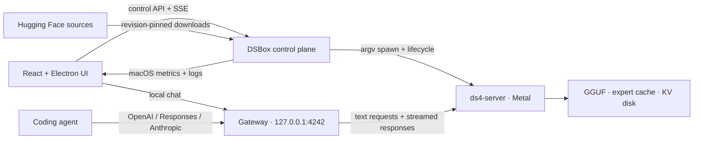

<p align="center">
  
</p>

<h1 align="center">DSBox</h1>

<p align="center"><strong>Your Mac. Your model. One switch.</strong></p>

<p align="center">
  A polished Apple Silicon desktop app for running
  <a href="https://github.com/andreaborio/ds4">andreaborio/ds4</a>
  with Metal, SSD streaming, local chat, coding-agent endpoints, and honest macOS telemetry.
</p>

<p align="center">
  <a href="https://github.com/andreaborio/dsbox/releases/latest"></a>
  <a href="https://github.com/andreaborio/dsbox/actions/workflows/ci.yml"></a>
  
  
  <a href="LICENSE"></a>
</p>

<p align="center">
  <a href="https://github.com/andreaborio/dsbox/releases/latest"><strong>Download for Apple Silicon</strong></a>
  · <a href="docs/INSTALL-macOS.md">Installation guide</a>
  · <a href="#run-from-source">Run from source</a>
</p>


<p align="center"><sub>A local-first workspace with persistent threads, a compact model switcher, optional reasoning, and a clean Codex-style interface.</sub></p>

## Why DSBox

- **One power control.** Once a model is selected, DSBox can prepare the checkout, build `ds4-server`, validate flags, start it, and wait for real readiness.
- **Models without path hunting.** Scan the Mac, choose a GGUF with Finder, or review and download a Hugging Face variant inside DSBox.
- **SSD streaming without artificial lockouts.** DSBox warns when a model may be very slow, but does not block an experiment merely because the GGUF is larger than unified memory.
- **A complete local chat.** Threads, reasoning, stop control, automatic scrolling, syntax-highlighted code, one-click copy, and response-level prefill/generation timings.
- **Bring your coding agent.** Stable OpenAI, Responses, and Anthropic-style loopback endpoints with ready-to-copy configurations.
- **Telemetry that says what it knows.** Memory pressure, committed memory, swap, CPU, process RSS, disk, and generation speed are reported; unsupported GPU metrics remain `N/A`.

## Three steps

1. **Choose a model.** Use a validated GGUF already on the Mac or explicitly confirm an in-app catalog download.
2. **Turn on DSBox.** The Server screen prepares and launches DS4 with Metal and SSD streaming.
3. **Chat or connect an agent.** Use the built-in interface, or copy the endpoint for Codex CLI, Claude Code, OpenCode, Pi, or another compatible client.

| Models | Server |
| --- | --- |
|  |  |
| Browse revision-pinned sources, compare variants, and see hardware guidance before downloading. | A single power surface keeps startup, adaptive defaults, runtime state, and safe shutdown understandable. |

## Models, made transparent

### Use a GGUF already on the Mac

**Scan this Mac** checks Spotlight first and falls back to a bounded filesystem scan. Before adding a result, DSBox reads the GGUF v3 header, architecture metadata, and tensor index to verify that the file uses a layout supported by DS4. It never reads the model-weight payload during this check, so validation stays lightweight even for very large files. Verified findings are stored in `~/.dsbox/local-models.json` with user-only permissions, so the chat model switcher opens immediately instead of scanning the disk again. Deleted, unreadable, corrupt, multipart, or incompatible entries are pruned automatically.

**Choose GGUF file…** opens the native Finder picker. DSBox uses the selected model in place: it does not copy or upload it, and it never asks a non-technical user to type a path.

A generic GGUF container is not enough: DS4 requires its own architecture metadata and tensor layout. Finder selection, disk scan, model switching, and server startup all use the same compatibility gate, with a specific explanation when a file cannot run.

### Download inside DSBox

The catalog reads DS4-oriented sources from the Hugging Face `andreaborio` profile and includes a checksum-pinned, DS4-native DwarfStar model from `antirez/deepseek-v4-gguf`. Unsloth repositories remain visible for provenance, but their current standard multipart GGUF builds cannot be selected or downloaded because DS4 does not support that layout. The exact revision, total size, file count, free-space check, and hardware advisory are shown before any compatible download begins.

Downloads are:

- explicitly confirmed—turning on the server never silently starts one;
- pinned to a Hugging Face revision;
- resumable after interruption;
- staged and committed atomically;
- size-verified, with SHA-256 verification when the source publishes it;
- enabled only when the model layout and runtime contract are explicitly verified for DS4.

Recommendations are made by **DSBox**, never presented as an endorsement from Andrea Borio, Antirez, or Unsloth.

### Switch models from chat

Installed inventory models appear beside the Thinking control. If DS4 is off, a selection applies to the next start. If it is running, DSBox validates the replacement first, restarts the server, and attempts to restore the previous model and runtime if the new launch fails. Switching is disabled while a generation, download, or conflicting runtime operation is active.

## Install the macOS app

DSBox ships as an arm64 Electron app for macOS 13 or later.

1. Download `DSBox-<version>-macOS-arm64.dmg` and `SHA256SUMS.txt` from the [latest release](https://github.com/andreaborio/dsbox/releases/latest).
2. Verify the download from the same folder:

   ```sh
   shasum -a 256 -c SHA256SUMS.txt
   ```

3. Open the DMG and drag **DSBox** to **Applications**.
4. The community build is ad-hoc signed but not notarized. On first launch, Control-click **DSBox**, choose **Open**, then confirm **Open**.

The checksum-first Gatekeeper and “app is damaged” recovery flow is documented in [`docs/INSTALL-macOS.md`](docs/INSTALL-macOS.md). Only bypass quarantine for an artifact whose checksum you have verified.

There is no automatic app updater yet. Upgrade by quitting DSBox and replacing the application with the newer DMG; models, configuration, downloads, and local threads live outside the app bundle.

## Run from source

Requirements: Apple Silicon, macOS 13+, Node.js 22+, Xcode Command Line Tools, and enough free SSD space for the selected model.

```sh
xcode-select --install
git clone https://github.com/andreaborio/dsbox.git
cd dsbox
./start.command
```

`start.command` installs JavaScript dependencies, builds the UI, starts the loopback control plane, and opens DSBox. For development:

```sh
npm ci
npm run dev
```

- UI: `http://127.0.0.1:5173`
- Gateway and control plane: `http://127.0.0.1:4242`

## Coding-agent endpoints

The public loopback gateway stays stable even if the internal DS4 port changes.

| Protocol | Base URL | Endpoint |
| --- | --- | --- |
| OpenAI Chat | `http://127.0.0.1:4242/v1` | `/chat/completions` |
| OpenAI Responses | `http://127.0.0.1:4242/v1` | `/responses` |
| Anthropic Messages | `http://127.0.0.1:4242` | `/v1/messages` |
| Model discovery | `http://127.0.0.1:4242/v1` | `/models` |

The **Agents** screen generates configurations using the currently selected model and gateway settings. If gateway authentication is enabled, copy the real key from Settings instead of using a placeholder.

Example Codex provider:

```toml
[model_providers.ds4]
name = "DS4 local"
base_url = "http://127.0.0.1:4242/v1"
wire_api = "responses"
stream_idle_timeout_ms = 1000000
```

Then use the model ID shown by DSBox:

```sh
codex --model <selected-model-id> -c model_provider=ds4
```

## SSD streaming and safety

DSBox does not pretend that “fits on SSD” means “will be fast.” A model larger than unified memory may run through DS4 SSD streaming, but speed depends on model structure, quantization, storage, thermal state, and cache warmth. Hardware guidance is advisory; insufficient disk space is the hard download blocker.

Adaptive mode lets DS4 calculate its expert-cache budget from live model geometry and available memory. DSBox independently watches macOS pressure and swap activity while the runtime is active, and performs a safety stop if pressure becomes unsafe or required signals repeatedly disappear. Manual context, cache, KV-disk, trace, imatrix, flags, and environment controls remain available in Settings.

<details>
<summary><strong>Recorded DeepSeek V4 Flash reference results</strong></summary>

The table below uses the 86.72 GB DeepSeek V4 Flash IQ2XXS/SExpQ8 GGUF and the immutable reference [`andreaborio/ds4@91e0f5d`](https://github.com/andreaborio/ds4/commit/91e0f5dc4dbf26280207b2ae642a9ff835bf488f). Short runs are highly sensitive to prompt length and macOS page-cache state; these are measurements, not hardware guarantees.

| Mac | Bounded workload | Generation throughput |
| --- | --- | ---: |
| M1 Pro, 16 GB | DSBox API, 9 prompt + 2 output tokens | 0.30 t/s cold; ~0.52 t/s warm |
| M5 Pro, 64 GB | two DSBox API requests, 22–23 prompt + 64 output tokens | 9.88 / 12.86 t/s |
| M5 Pro, 64 GB | `ds4-bench`, 128 prompt + 64 decode tokens | 13.05 / 13.59 t/s |

</details>

## Privacy and current limits

- Inference, models, configuration, and thread history stay on the Mac. Threads use browser/Electron local storage; they are not encrypted or synchronized.
- The control plane and internal DS4 server bind to loopback only. Mutating control actions require a custom header, and optional Bearer/`x-api-key` gateway authentication is available.
- DSBox is currently text-only. Image, audio, video, and file parts are rejected before they can reach DS4.
- Automatic web search is intentionally transparent in the composer, but it is not fully offline: when the local router detects an explicit or time-sensitive search request, a normalized query of at most 400 characters is sent to DuckDuckGo Lite. Search failure falls back to local inference.
- Metal utilization remains `N/A` because macOS does not expose a reliable per-process value without elevated tooling. DSBox does not use `sudo` or `powermetrics`.
- The community DMG is ad-hoc signed and not notarized. A fully trusted first launch requires Apple Developer ID signing and notarization.

## Architecture



The gateway parses and validates incoming requests, rejects unsupported media, removes hop-by-hop headers, and relays response status, safe headers, and streaming bytes. It does not translate semantic text, tool, or reasoning fields.

## Development and releases

```sh
npm run typecheck
npm test
npm run build
```

Build and verify the macOS artifacts:

```sh
npm run pack:mac
npm run dist:mac
npm run verify:mac
```

A version tag matching `package.json` runs the same checks on GitHub Actions and publishes the DMG, SHA-256 file, and installation guide.

## Security

Please report security issues privately to the repository owner. Do not expose DSBox or `ds4-server` directly on `0.0.0.0`; use an SSH tunnel for access from another machine.

## License

[MIT](LICENSE)
