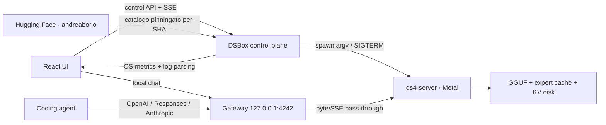

# DSBox

DSBox è un client locale per avviare e usare la fork [andreaborio/ds4](https://github.com/andreaborio/ds4) su Apple Silicon. L'obiettivo è trasformare build, configurazione Metal, SSD streaming, monitoraggio e collegamento dei coding agent in un flusso guidato e one-click.

L'interfaccia è volutamente essenziale: chat in stile ChatGPT, un solo pulsante per accendere il server, configurazioni modificabili da UI, log live, metriche reali del Mac e snippet pronti per Codex, Claude Code, OpenCode, Pi e client OpenAI-compatible. Chi non vuole occuparsi dei dettagli tecnici può lasciare tutte le impostazioni sui valori automatici.

## Cosa include

- installazione o aggiornamento conservativo della fork, senza sovrascrivere commit o modifiche locali;
- rilevamento dei checkout `andreaborio/ds4` già presenti sul Mac;
- build nativa di `ds4-server` per Metal;
- accensione one-click: DSBox prepara motore, modello e memoria prima di avviare il server;
- catalogo dei futuri modelli DS4 pubblicati su Hugging Face dall'account `andreaborio`;
- raccomandazioni attribuite sempre a DSBox, mai all'autore del catalogo;
- avvio e arresto graceful del processo, con attesa reale di `GET /v1/models`;
- profilo 64 GB con `--ssd-streaming`, context 32K e cache expert 32 GB;
- profilo con budget automatico della cache;
- gestione da UI di context, power, thread, prefill, KV disk, trace, imatrix, flag ed environment;
- gateway locale stabile su `http://127.0.0.1:4242`;
- pass-through byte-stream di Chat Completions, Responses e Anthropic Messages, incluso SSE;
- chat locale con reasoning collassabile e stop della generazione;
- monitor a 1 Hz per RAM, memory pressure, swap, CPU, RSS del processo, spazio SSD e throughput estratto dai log;
- zero metriche GPU inventate: Metal utilization resta `N/D` quando macOS non la espone senza privilegi;
- configurazione persistente in `~/.dsbox/config.json`.

## Avvio rapido

Requisiti:

- Mac Apple Silicon;
- Node.js 22 o successivo;
- Xcode Command Line Tools per compilare ds4 (`xcode-select --install`);
- spazio SSD adeguato al modello e alla KV cache.

Dal Finder fai doppio click su `start.command`, oppure:

```sh
./start.command
```

Al primo avvio `start.command` installa le dipendenze dell'app, compila la UI, avvia il control plane su loopback e apre il browser. Da quel momento il server locale si controlla con **Accendi** nella barra superiore o con il grande pulsante nella schermata **Server**. Quel singolo click avvia anche l'eventuale download del modello, che può occupare decine di GB.

Per sviluppo:

```sh
npm ci
npm run dev
```

UI: `http://127.0.0.1:5173`

API locale: `http://127.0.0.1:4242`

## Primo setup

1. Apri DSBox con `start.command`.
2. Premi **Accendi**. Non devi scegliere o configurare altro.
3. Attendi il messaggio **DSBox è acceso**. Il primo download e la compilazione possono richiedere tempo; i download interrotti ripartono dal punto raggiunto.

Non è necessario scegliere una branch, calcolare la cache o conoscere lo SSD streaming: DSBox usa valori conservativi adatti al Mac rilevato. Le scelte manuali restano disponibili in **Impostazioni** e i dettagli di checkout, comando e log sono raccolti nella sezione tecnica.

Il comando effettivo è sempre verificabile. Il processo viene creato con un array `argv`, mai tramite una stringa passata alla shell.

## Modelli: catalogo e raccomandazioni

DSBox cerca i futuri modelli ottimizzati tra i repository pubblici con tag `ds4` del profilo Hugging Face [`andreaborio`](https://huggingface.co/andreaborio/models). Il nome dell'account indica esclusivamente la provenienza del file: non implica che Andrea Borio abbia raccomandato un modello o una configurazione.

Quando un modello supera le regole del catalogo, l'interfaccia mostra il badge **Consigliato da DSBox**. L'attribuzione non cambia in base all'autore del repository. Per entrare nel percorso automatico un modello deve:

- pubblicare un manifest `dsbox.json` con `schemaVersion: 1`;
- dichiarare `status: "stable"` ed essere candidato alla selezione automatica;
- offrire un singolo file GGUF installabile;
- pubblicare il checksum SHA-256 LFS del GGUF;
- essere compatibile con la memoria unificata del Mac e con il canale DS4 selezionato;
- non essere contrassegnato come sperimentale.

Il modello oggi presente sul profilo, [`andreaborio/glm52-ds4-native-64g-q2k-experimental`](https://huggingface.co/andreaborio/glm52-ds4-native-64g-q2k-experimental), è un artefatto sperimentale e multipart pensato per prove avanzate. DSBox lo esclude quindi dal default e non lo presenta come raccomandato. Finché il catalogo non contiene un candidato idoneo, la prima accensione usa il percorso automatico `q2-imatrix` previsto dalla fork.

È sempre possibile usare dalla sezione **Impostazioni** un GGUF proprio già compatibile con il layout previsto da DS4. Questa scelta non riceve automaticamente un badge e non modifica il catalogo DSBox.

### Manifest `dsbox.json` v1

Un esempio minimale è disponibile in [`docs/dsbox-manifest-v1.json`](docs/dsbox-manifest-v1.json). Il file deve trovarsi nella root del repository del modello. DSBox legge manifest, metadati e download dalla stessa revisione Git pinningata, così il contenuto validato non può cambiare durante l'installazione.

| Campo | Significato |
| --- | --- |
| `schemaVersion` | Deve essere `1`. Versioni sconosciute vengono ignorate. |
| `name`, `description` | Testi mostrati nel catalogo. |
| `status` | Solo `stable` è idoneo alla selezione automatica. |
| `recommended` | Segnala un candidato alla policy DSBox; non è mostrato come endorsement dell'autore. |
| `file` | Percorso esatto di un singolo file `.gguf` nel repository. |
| `modelId` | ID esposto ai client OpenAI/Anthropic; obbligatorio per la selezione automatica. |
| `runtimeBranch` | Branch della fork DS4 richiesta dal modello, per esempio `main`; obbligatorio per la selezione automatica. |
| `runtimeCommit` | Commit Git completo minimo della fork: DSBox aggiorna e ricompila un checkout pulito prima del download. |
| `minimumMemoryGb` | Memoria unificata minima; obbligatoria per la selezione automatica. |

Il manifest descrive un artefatto; non può inserire comandi shell, variabili d'ambiente o flag arbitrari nel processo di avvio.

## Canali della fork

I due canali non sono intercambiabili:

| Canale | Modello | Stato |
| --- | --- | --- |
| `main` | DeepSeek V4 Flash / PRO | predefinito |
| `codex/glm52-upstream-clean-bench` | GLM 5.2 | sperimentale |

Non usare il branch GLM per DeepSeek: la fork documenta una regressione di decode su quella linea. Per GLM, il model ID deve essere letto da `/v1/models` (`glm-5.2`, `glm-5.2-chat` o `glm-5.2-reasoner`) e il GGUF deve avere il layout previsto dalla fork.

DSBox verifica ogni flag configurato contro `ds4-server --help all` prima dello spawn. Un flag presente solo su un altro branch produce un errore leggibile invece di un avvio ambiguo.

## Coding agent

Il gateway DSBox resta stabile anche se la porta interna di ds4 cambia:

| Protocollo | Base URL | Endpoint principale |
| --- | --- | --- |
| OpenAI Chat | `http://127.0.0.1:4242/v1` | `/chat/completions` |
| OpenAI Responses / Codex | `http://127.0.0.1:4242/v1` | `/responses` |
| Anthropic / Claude Code | `http://127.0.0.1:4242` | `/v1/messages` |
| Discovery | `http://127.0.0.1:4242/v1` | `/models` |

Esempio Codex CLI:

```toml
[model_providers.ds4]
name = "DS4 local"
base_url = "http://127.0.0.1:4242/v1"
wire_api = "responses"
stream_idle_timeout_ms = 1000000
```

Se abiliti **Richiedi API key** nel gateway, aggiungi anche `env_key = "DSBOX_API_KEY"` al provider ed esporta quella variabile prima di avviare Codex. Senza `env_key` e senza `requires_openai_auth`, Codex tratta correttamente il provider locale come privo di autenticazione.

```sh
codex --model deepseek-v4-flash -c model_provider=ds4
```

Esempio Claude Code:

```sh
export ANTHROPIC_BASE_URL=http://127.0.0.1:4242
export ANTHROPIC_AUTH_TOKEN=dsbox-local
export ANTHROPIC_MODEL=deepseek-v4-flash
```

La schermata **Agenti** genera gli snippet completi usando URL, model ID, context, output limit e API key correnti.

## Architettura



`ds4-server` ascolta soltanto su `127.0.0.1:8000` per impostazione predefinita. Il gateway non modifica JSON, reasoning o tool call: inoltra status, header e stream per mantenere la compatibilità della fork.

Il runtime usa un solo graph worker; le richieste concorrenti vengono serializzate. DSBox non finge batching o parallelismo che ds4 non implementa.

### Indicatore di attività

Il core DSBox usa un piccolo SVG animato per rendere visibile lo stato reale del runtime: preparazione, prefill, thinking, decode, pronto o errore. Gli eventi arrivano dal gateway anche quando la richiesta parte da un coding agent esterno, non soltanto dalla chat integrata. L'indicatore resta statico quando non c'è lavoro e rispetta `prefers-reduced-motion`; non usa WebGL, canvas o GPU.

## Sicurezza e privacy

- Il control plane rifiuta un bind non-loopback.
- Il server ds4 interno è sempre avviato con `--host 127.0.0.1`.
- Le azioni mutanti `/api/*` richiedono un header custom, così una pagina web esterna non può avviare o fermare il runtime tramite un form CSRF.
- Il gateway può richiedere Bearer o `x-api-key`; in modalità loopback la chiave può restare disattivata.
- Non viene abilitato `--cors` su ds4.
- La UI non carica script, font o asset da CDN.
- `--trace` è disattivato: quando attivo può contenere prompt, output e tool call in chiaro.
- La KV cache su disco può contenere testo del prompt; DSBox la crea con permessi utente e non la cancella automaticamente.
- Nessun comando usa `sudo` o `powermetrics`.

Per accesso da un altro computer usa un tunnel SSH. Non esporre direttamente `ds4-server` o il control plane su `0.0.0.0`.

## Flag supportati in UI

Profilo base:

- `--metal`
- `--ssd-streaming`
- `--ssd-streaming-cache-experts NGB`
- `--ssd-streaming-cold`
- `--ssd-streaming-preload-experts N`
- `--ctx`, `--tokens`, `--threads`, `--power`
- `--prefill-chunk`, `--quality`, `--warm-weights`
- `--kv-disk-dir`, `--kv-disk-space-mb`
- `--kv-cache-min-tokens`, `--kv-cache-continued-interval-tokens`
- `--trace`
- `--imatrix-out`, `--imatrix-every` quando presenti sul branch.

La sezione **Avanzate** accetta flag aggiuntivi e righe `KEY=value`. Le virgolette vengono tokenizzate, ma non c'è interpretazione shell. Flag non esposti dal binario selezionato vengono rifiutati prima dell'avvio.

## Monitoraggio

Metriche verificate:

- memoria unificata impegnata, calcolata da pagine anonime non eliminabili, memoria wired e compressore fisico tramite `vm_stat`;
- file cache riutilizzabile mostrata separatamente, senza confonderla con RAM realmente sotto pressione;
- memory pressure e livello kernel (`normale`, `attenzione`, `critica`) tramite `memory_pressure -Q` e `kern.memorystatus_vm_pressure_level`;
- swap tramite `sysctl vm.swapusage`;
- CPU sistema;
- CPU e RSS del PID ds4 tramite `ps`;
- spazio libero sul volume con `statfs`;
- token/s estratti dalle righe di decode di ds4.

Non sono disponibili senza instrumentation aggiuntiva:

- GPU utilization Metal cross-process;
- byte/s SSD per il solo processo;
- hit rate continuo della cache routed expert.

Questi valori restano `N/D` invece di essere stimati.

## Test e build

```sh
npm run typecheck
npm test
npm run build
```

I test coprono configurazione, tokenizzazione sicura degli argomenti, preset 64/128 GB, vincoli loopback, catalogo revision-pinned, filtro dei modelli sperimentali, accensione one-click, API del control plane e pass-through SSE con keepalive di prefill.

## Limiti attuali

- Questa prima versione è un'app locale web-first avviabile con `start.command`; una release firmata/notarizzata `.app` è lavoro successivo.
- DSBox compila la fork sul Mac. Una distribuzione pubblica dovrebbe pinningare SHA e scaricare un bundle Metal firmato con checksum e rollback.
- Il catalogo one-click installa soltanto artefatti con un singolo GGUF. Repository multipart, incluso il modello GLM sperimentale corrente, richiedono ancora una procedura manuale.
- I download dal catalogo sono resumable e pinningati a una revisione; DSBox non converte né ricompone automaticamente i GGUF.
- Lo stop normale usa SIGTERM e lascia a ds4 il tempo di drenare la richiesta e salvare KV. Il force-stop è separato e può perdere l'ultimo checkpoint.

## Licenza

DSBox è distribuito sotto licenza MIT. `andreaborio/ds4`, i modelli e le relative dipendenze mantengono licenze proprie.
