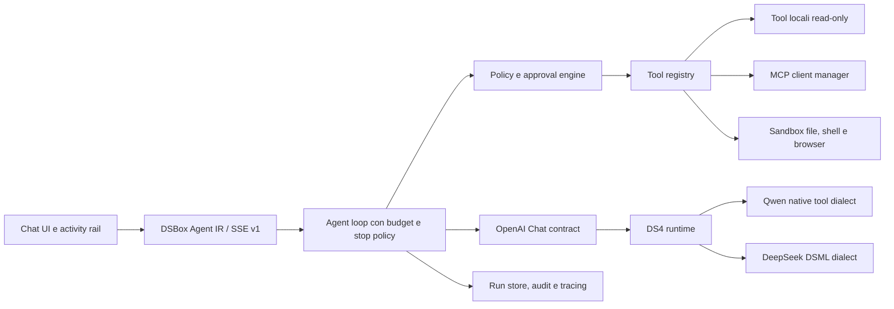

# DSBox agentic chat: benchmark competitivo e roadmap

Stato della ricerca: 15 luglio 2026. Obiettivo: portare la chat integrata allo
stato dell'arte senza legarla al formato interno di un singolo modello. Il
target primario e' la coppia Qwen3.6 35B-A3B e DeepSeek V4 Flash eseguita da
DS4 su Apple Silicon.

## Sintesi decisionale

La direzione corretta non e' aggiungere integrazioni ad hoc alla UI. DSBox deve
avere un solo runtime agentico canonico, un registry di tool governato da
policy e adapter di modello confinati in DS4. Qwen e DeepSeek possono usare
dialetti diversi durante la generazione, ma la UI e il loop devono vedere lo
stesso contratto OpenAI-style: `assistant.tool_calls`, messaggi `role: tool` ed
eventi SSE DSBox neutrali rispetto al modello.

La prima verticale, gia' implementata nei branch di lavoro, include capability
discovery reale, loop multi-step, chiamate parallele limitate, tre tool di sola
lettura, consenso esplicito per la rete, UI delle attivita' e supporto nativo
Qwen in DS4. Il prossimo investimento deve essere policy/approval + MCP
read-only. File write, shell e browser operativo devono restare fuori finche'
non esistono sandbox, audit e ripresa sicura del run.

## Cosa fanno i prodotti di riferimento

| Prodotto o protocollo | Pattern utile | Limite o lezione per DSBox |
| --- | --- | --- |
| OpenAI Function Calling | Il modello propone chiamate strutturate, l'applicazione le esegue e reinvia i risultati; supporta strict schema, chiamate parallele e restrizione dinamica dei tool ammessi. | Separare sempre proposta ed esecuzione; il modello non possiede l'autorita' del tool. |
| Anthropic tool use | Distingue tool client-side e server-side, usa blocchi `tool_use`/`tool_result`, strict validation e parallel tool use. | Il lifecycle deve essere visibile e il risultato deve conservare l'identita' della chiamata. |
| Gemini function calling | Supporta chiamate parallele e sequenziali/compositive; l'applicazione resta responsabile dell'esecuzione dei custom tool e delle conferme. | Il loop non puo' fermarsi al primo tool round; servono limiti e conferme fuori dal modello. |
| MCP | Standardizza discovery e invocazione, ma richiede validazione input, access control, timeout, sanitizzazione output, indicatori e conferma umana per operazioni sensibili. | MCP e' un trasporto/contratto, non una sandbox ne' una policy di sicurezza. |
| LM Studio | Offre un runtime locale con API native stateful, compatibilita' OpenAI/Anthropic e integrazione MCP. | DSBox deve offrire la stessa semplicita' locale, mantenendo esplicito lo stato reale di DS4. |
| LibreChat | Combina agenti, MCP, tool differiti, limiti di step e sub-agent. | La discovery progressiva evita di riempire il context con tutti gli schema disponibili. |
| Open WebUI | Espone function calling agentico e piu' forme di tool server in una UI locale. | La UX deve mostrare cosa sta girando e non ridurre i tool a testo nascosto nella risposta. |
| Vercel AI SDK | Tratta tool call e tool result come parti persistenti del messaggio e usa loop multi-step con stop condition esplicite. | La history canonica completa e' necessaria per follow-up corretti e replay. |
| LangGraph | Interrompe e persiste un run prima di un'azione, poi consente approve, edit o reject. | Le approvazioni serie richiedono un run resumable; un semplice modal non basta. |

Fonti primarie e documentazione prodotto:

- [OpenAI function calling](https://developers.openai.com/api/docs/guides/function-calling)
- [Anthropic tool use](https://platform.claude.com/docs/en/agents-and-tools/tool-use/overview)
- [Gemini function calling](https://ai.google.dev/gemini-api/docs/function-calling)
- [MCP tools specification](https://modelcontextprotocol.io/specification/2025-06-18/server/tools)
- [DeepSeek tool calls](https://api-docs.deepseek.com/guides/tool_calls)
- [Qwen function calling](https://qwen.readthedocs.io/en/stable/framework/function_call.html)
- [LM Studio REST API](https://lmstudio.ai/docs/developer/rest)
- [LibreChat agents](https://www.librechat.ai/docs/features/agents)
- [Open WebUI tools](https://docs.openwebui.com/features/extensibility/plugin/tools/)
- [Vercel AI SDK tools](https://ai-sdk.dev/docs/ai-sdk-core/tools-and-tool-calling)
- [LangGraph human in the loop](https://docs.langchain.com/oss/python/langchain/human-in-the-loop)

## Architettura target

Principi non negoziabili:

1. Capability da metadata/probe reali, mai dal nome del modello.
2. Un IR persistibile tra UI e backend; nessun tag Qwen/DSML nel frontend.
3. Schema validation sia prima dell'esecuzione sia sul risultato.
4. Tool registry separato dal model prompt e filtrato per ogni singolo run.
5. Rete, write, shell e azioni esterne negate per default.
6. Budget distinti per step, numero chiamate, concorrenza, tempo e byte.
7. Stream incompleto o output protocollo malformato devono fallire chiusi.
8. `call_id`, reasoning del tool round e risultati devono sopravvivere a
   continuation, persistenza e reload.

## Contratti implementati

### Capability contract

`GET /api/capabilities` interroga `/v1/models` e, quando i metadata non sono
conclusivi, effettua un probe innocuo con `tool_choice: none`. Il risultato
distingue `supported`, `unsupported` e `unknown`; quest'ultimo viene ritentato
dopo la scadenza della cache breve. L'Agent mode si abilita solo nello stato
`ready + supported`.

### Agent request e history

`POST /api/agent/chat` riceve history OpenAI-style. Una continuation corretta
contiene un solo messaggio assistant con tutte le tool call parallele del model
step, seguito da un messaggio `role: tool` per ciascun `call_id`. Il reasoning
del round viene conservato internamente per non perdere il contesto causale e
la possibilita' di riuso del prefix.

### Agent SSE v1

Gli eventi principali sono:

- `run.created`, `run.completed`, `run.error`;
- `reasoning.delta`, `text.delta`;
- `tool_call.created`, `tool_call.arguments.delta`,
  `tool_call.arguments.done`;
- `tool_call.started`, `tool_call.result`, `tool_call.failed`.

Ogni evento include `runId`, sequenza e `step`; gli eventi tool includono
`callId`. Il client richiede sia `run.completed` sia il terminale `[DONE]`.

### Guardrail correnti

- massimo 8 tool call per model turn;
- massimo 24 tool call per run;
- massimo 8 tool round;
- massimo 3 tool eseguiti in parallelo;
- timeout e limiti di output per runtime e tool;
- `web_search` assente dal prompt salvo consenso esplicito nella richiesta;
- risultati web marcati come dati non fidati anche nei turn successivi;
- nessun `open_url`: prima servono difese SSRF, redirect e DNS rebinding;
- stop/reload convertono tool pending in `canceled`.

## Matrice Qwen / DeepSeek

| Capacita' | Qwen3.6 35B-A3B | DeepSeek V4 Flash | Contratto DSBox |
| --- | --- | --- | --- |
| Dialetto generato | Tag nativi Qwen `tool_call/function/parameter` | DSML nativo DS4 | Mai esposto fuori da DS4 |
| API usata dal loop | OpenAI Chat Completions | OpenAI Chat Completions | Identica |
| Tool history | OpenAI history convertita dal renderer Qwen | OpenAI history convertita dal renderer DeepSeek | `assistant.tool_calls` + `role: tool` |
| Chiamate multiple | Si', validate e ordinate | Si' | Un assistant step, N risultati |
| Tipi JSON | Ricostruiti dallo schema, incluso nullable | Inclusi nel DSML | Arguments JSON canonici |
| Reasoning | Preservato nel tool continuation; omissibile nei normali user follow-up | Preservato nel tool continuation | `reasoning_content` interno |
| Streaming | Testo/reasoning live; markup trattenuto e normalizzato a EOS | Delta reasoning e tool arguments | Eventi SSE DSBox |
| Output malformato | Fail-closed, nessun falso successo vuoto | Recovery DSML esistente o errore | `run.error`, mai tool execution |
| Responses / Anthropic tool use | Non dichiarato in questa tranche | Supporto DS4 esistente, fuori dal loop UI | Possibile fase successiva |

## Roadmap eseguibile

### P0 - Fondazione read-only (implementata nel branch)

Deliverable:

- capability probe e fallback standard chat;
- Agent IR SSE e history persistibile;
- loop multi-step comune Qwen/DeepSeek;
- `runtime_status`, `model_info`, `web_search` con consenso;
- UI activity card, stato, durata, input/result e cancel;
- parser Qwen schema-aware in DS4 e regressione reale DeepSeek;
- limiti di fan-out, concorrenza, timeout e dimensione;
- test di stream troncato/malformato, chiamate parallele e follow-up.

Exit gate: test unitari completi, typecheck/build, sanitizer DS4, round-trip reale
tool -> result -> risposta finale su entrambi i modelli. La patch DS4 e' stata
pubblicata nel [draft PR #2](https://github.com/andreaborio/ds4/pull/2) e DSBox
punta al relativo commit verificato; prima del rilascio stabile il PR va unito e
il canale runtime riportato da `codex/qwen-tool-dialect` a `main`.

### P1 - Policy, approval e audit

Deliverable:

- manifest per tool con `risk`, `network`, `write`, `secrets`, timeout e limiti;
- decisione deterministica `allow`, `ask`, `deny` fuori dal modello;
- run persistibile con stato `waiting_for_approval`;
- UX approve/edit/reject che mostra nome, argomenti e impatto;
- audit append-only di proposta, decisione, esecuzione e risultato redatto;
- idempotency key per impedire una doppia esecuzione dopo retry/reload;
- kill propagation dal tasto Stop fino al processo/tool sottostante.

Exit gate: nessun side effect senza decisione esplicita, resume dopo reload,
reject non esegue il tool, retry non duplica l'azione, segreti assenti da log e
prompt.

### P2 - MCP read-only e discovery progressiva

Deliverable:

- MCP client manager per server locali esplicitamente configurati;
- allowlist di server e tool, schema normalization e health state;
- discovery differita: il modello vede un catalogo compatto e carica solo gli
  schema necessari;
- namespace stabile per evitare collisioni tra server;
- resource/file read-only con root consentite e limiti byte;
- provenance e citazioni collegate al singolo tool result;
- fetch URL sicuro con HTTP(S) only, IP privati negati, DNS pinning, redirect
  limitati e content-type/size limit.

Exit gate: un server MCP compromesso non puo' ottenere file, rete o tool fuori
dallo scope; prompt injection nei risultati resta untrusted data; 100 tool
installati non gonfiano il prompt iniziale.

### P3 - Workspace, write e code execution in sandbox

Deliverable:

- file read con root workspace esplicita e symlink-safe path resolution;
- write tramite patch/diff preview, approval e rollback;
- shell in sandbox con cwd, env allowlist, wall/CPU/output limits e network off;
- checkpoint Git o snapshot prima delle mutazioni;
- artifact channel separato dai normali messaggi chat;
- profili `chat`, `research`, `coding` che cambiano i tool ammessi, non il
  comportamento nascosto del modello.

Exit gate: escape suite negativa, nessuna lettura fuori root, nessuna rete non
autorizzata, diff sempre mostrato prima di write, rollback verificato.

### P4 - Run durevoli e orchestrazione

Deliverable:

- run store con event log e ricostruzione deterministica;
- background task con pause/resume/cancel e scadenza;
- retry per classe di errore con backoff e budget globale;
- sub-agent limitati a scope, tool e token budget propri;
- merge dei risultati con provenance, senza condividere segreti impliciti;
- notifica e inbox dei run terminati.

Exit gate: riavvio dell'app durante tool/approval non perde stato, cancel e'
definitivo, un sub-agent non puo' ampliare i privilegi del parent.

### P5 - Eval e osservabilita' come release gate

Questa fase va iniziata in parallelo a P1, ma diventa bloccante prima di P3.

Deliverable:

- corpus identico Qwen/DeepSeek per scelta tool, argomenti, no-tool, parallel,
  repair e injection;
- metriche: tool selection accuracy, argument validity, execution success,
  unnecessary-call rate, steps/run, latency e byte di context;
- tracing locale redatto con replay di soli eventi non sensibili;
- test avversariali su result injection, schema bomb, call-id collision,
  stream truncation e approval replay;
- dashboard per tempo modello, coda, tool e overhead del loop.

Release gate iniziale:

- 100% continuita' dei `call_id` nei test;
- zero tool malformati eseguiti;
- zero chiamate web senza consenso;
- zero falsi `run.completed` su stream troncato o `finish_reason: error`;
- parita' funzionale Qwen/DeepSeek sul set read-only;
- nessuna regressione della normale chat senza Agent mode.

## Ordine consigliato delle prossime integrazioni

1. Unire il supporto Qwen DS4 e riportare il canale runtime DSBox a `main`,
   conservando `fc1561f` come commit minimo.
2. Aggiungere run store + policy/approval + audit prima di qualunque write.
3. Integrare MCP read-only con discovery differita.
4. Aggiungere file read e citazioni/provenance.
5. Solo dopo i gate di sicurezza: patch write e shell sandboxed.
6. Infine background run e sub-agent, quando tracing e budget sono maturi.

Questa sequenza mantiene Qwen e DeepSeek sullo stesso prodotto: le differenze
di sintassi restano un dettaglio del runtime, mentre sicurezza, UX, history,
tool policy ed eval evolvono una volta sola in DSBox.
