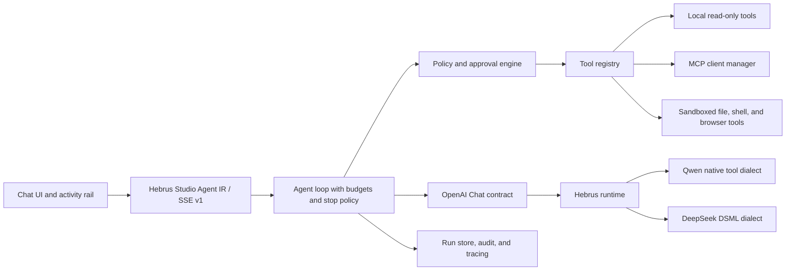

# Hebrus Studio Agentic Chat: Competitive Review And Roadmap

Research snapshot: July 15, 2026. This document was refreshed for the Hebrus
Studio and Hebrus public names; exact legacy identifiers and historical links
remain unchanged where compatibility or provenance requires them. The goal is
to bring the integrated chat experience to the state of the art without tying
it to one model's internal format. The primary target is Qwen3.6 35B-A3B and
DeepSeek V4 Flash running through Hebrus on Apple Silicon.

## Decision Summary

The right direction is not to add ad hoc integrations to the UI. Hebrus Studio
should have one canonical agent runtime, a policy-governed tool registry, and
model adapters confined to Hebrus. Qwen and DeepSeek may use different dialects
during generation, but the UI and loop should see the same OpenAI-style
contract: `assistant.tool_calls`, `role: tool` messages, and model-neutral
Hebrus Studio SSE events.

The first vertical, already implemented on the development branches, includes
real capability discovery, a multi-step loop, bounded parallel calls, three
read-only tools, explicit network consent, an activity UI, and native Qwen
support in the engine. The next investment should be policy and approval plus
read-only MCP. File writes, shell access, and an operative browser must remain
out of scope until sandboxing, audit, and safe run resumption exist.

## What Reference Products Do

| Product or protocol | Useful pattern | Constraint or lesson for Hebrus Studio |
| --- | --- | --- |
| OpenAI Function Calling | The model proposes structured calls, the application executes them and sends back results; it supports strict schemas, parallel calls, and dynamic restriction of allowed tools. | Always separate proposal from execution; the model does not own tool authority. |
| Anthropic tool use | Separates client-side and server-side tools and uses `tool_use`/`tool_result` blocks, strict validation, and parallel tool use. | The lifecycle must be visible, and every result must preserve the call identity. |
| Gemini function calling | Supports parallel and sequential or compositional calls; the application remains responsible for custom-tool execution and confirmation. | The loop cannot stop after the first tool round; limits and confirmations must live outside the model. |
| MCP | Standardizes discovery and invocation but still requires input validation, access control, timeouts, output sanitization, indicators, and human confirmation for sensitive operations. | MCP is a transport and contract, not a sandbox or security policy. |
| LM Studio | Provides a local runtime with stateful native APIs, OpenAI/Anthropic compatibility, and MCP integration. | Hebrus Studio should offer the same local simplicity while exposing the real state of Hebrus. |
| LibreChat | Combines agents, MCP, deferred tools, step limits, and sub-agents. | Progressive discovery avoids filling the context with every available schema. |
| Open WebUI | Exposes agentic function calling and several forms of server-side tools in a local UI. | The UX must show what is running instead of reducing tools to hidden response text. |
| Vercel AI SDK | Treats tool calls and tool results as persistent message parts and uses multi-step loops with explicit stop conditions. | Complete canonical history is necessary for correct follow-ups and replay. |
| LangGraph | Interrupts and persists a run before an action, then supports approve, edit, or reject. | Serious approvals require a resumable run; a modal alone is insufficient. |

Primary sources and product documentation:

- [OpenAI function calling](https://developers.openai.com/api/docs/guides/function-calling)
- [Anthropic tool use](https://platform.claude.com/docs/en/agents-and-tools/tool-use/overview)
- [Gemini function calling](https://ai.google.dev/gemini-api/docs/function-calling)
- [MCP tools specification](https://modelcontextprotocol.io/specification/2025-06-18/server/tools)
- [DeepSeek tool calls](https://api-docs.deepseek.com/guides/tool_calls)
- [Qwen function calling](https://qwen.readthedocs.io/en/stable/framework/function_call.html)
- [LM Studio REST API](https://lmstudio.ai/docs/developer/rest)
- [LibreChat agents](https://www.librechat.ai/docs/features/agents)
- [Open WebUI tools](https://docs.openwebui.com/features/extensibility/plugin/tools/)
- [Vercel AI SDK tools](https://ai-sdk.dev/docs/ai-sdk-core/tools-and-tool-calling)
- [LangGraph human in the loop](https://docs.langchain.com/oss/python/langchain/human-in-the-loop)

## Target Architecture

Non-negotiable principles:

1. Derive capabilities from real metadata or probes, never from the model name.
2. Keep one persistable IR between the UI and backend; no Qwen or DSML tags in
   the frontend.
3. Validate schemas before execution and validate the resulting value.
4. Keep the tool registry separate from the model prompt and filter it for each
   individual run.
5. Deny network, write, shell, and external actions by default.
6. Use separate budgets for steps, call count, concurrency, time, and bytes.
7. Fail closed on incomplete streams or malformed protocol output.
8. Preserve `call_id`, tool-round reasoning, and results across continuation,
   persistence, and reload.

## Implemented Contracts

### Capability Contract

`GET /api/capabilities` queries `/v1/models` and, when the metadata is
inconclusive, performs a harmless probe with `tool_choice: none`. The result
distinguishes `supported`, `unsupported`, and `unknown`; the last state is
retried after the short cache expires. Agent mode is enabled only in the
`ready + supported` state.

### Agent Request And History

`POST /api/agent/chat` receives OpenAI-style history. A correct continuation
contains one assistant message with every parallel tool call from the model
step, followed by one `role: tool` message for each `call_id`. The round's
reasoning is retained internally so causal context and prefix reuse are not
lost.

### Agent SSE v1

The main events are:

- `run.created`, `run.completed`, `run.error`;
- `reasoning.delta`, `text.delta`;
- `tool_call.created`, `tool_call.arguments.delta`,
  `tool_call.arguments.done`;
- `tool_call.started`, `tool_call.result`, `tool_call.failed`.

Every event includes `runId`, sequence, and `step`; tool events also include
`callId`. The client requires both `run.completed` and the terminal `[DONE]`.

### Current Guardrails

- at most 8 tool calls per model turn;
- at most 24 tool calls per run;
- at most 8 tool rounds;
- at most 3 tools executing in parallel;
- timeouts and output limits for both runtime and tools;
- `web_search` enabled by default in Agent mode, with a visible persistent
  opt-out;
- opt-out enforced by the executor before network access; web schemas already
  cited in history remain only so the transcript stays parseable;
- web results marked as untrusted data in subsequent turns as well;
- no `open_url`: SSRF, redirect, and DNS-rebinding defenses must exist first;
- stop or reload converts pending tools to `canceled`.

## Qwen And DeepSeek Matrix

| Capability | Qwen3.6 35B-A3B | DeepSeek V4 Flash | Hebrus Studio contract |
| --- | --- | --- | --- |
| Generated dialect | Native Qwen `tool_call/function/parameter` tags | Native Hebrus DSML | Never exposed outside Hebrus |
| API used by the loop | OpenAI Chat Completions | OpenAI Chat Completions | Identical |
| Tool history | OpenAI history converted by the Qwen renderer | OpenAI history converted by the DeepSeek renderer | `assistant.tool_calls` + `role: tool` |
| Multiple calls | Yes, validated and ordered | Yes | One assistant step, N results |
| JSON types | Reconstructed from the schema, including nullable types | Included in DSML | Canonical JSON arguments |
| Reasoning | Preserved in tool continuation; optional in ordinary user follow-ups | Preserved in tool continuation | Internal `reasoning_content` |
| Streaming | Live text and reasoning; markup buffered and normalized at EOS | Reasoning and tool-argument deltas | Hebrus Studio SSE events |
| Malformed output | Fail closed, never report false empty success | Existing DSML recovery or error | `run.error`, never tool execution |
| Responses / Anthropic tool use | Not declared in this tranche | Existing legacy DS4 support, outside the UI loop | Possible later phase |

## Executable Roadmap

### P0 - Read-Only Foundation (Implemented On The Development Branch)

Deliverables:

- capability probe and standard-chat fallback;
- Agent IR SSE and persistable history;
- one multi-step Qwen/DeepSeek loop;
- automatic `runtime_status`, `model_info`, and `web_search` with opt-out;
- activity-card UI with state, duration, input/result, and cancel;
- schema-aware Qwen parser in Hebrus and a real DeepSeek regression;
- fan-out, concurrency, timeout, and size limits;
- tests for truncated or malformed streams, parallel calls, and follow-ups.

Exit gate: complete unit tests, typecheck/build, engine sanitizer, and a real
tool -> result -> final-answer round trip on both models. The original engine
patch was published in [draft PR #2](https://github.com/andreaborio/hebrus/pull/2)
under the historical repository name. The release runtime is now the unified
`main` channel, with ExpertMajor v2 and minimum pin
`57acfd408a3154851a0c59be432904300abb3b6c`.

### P1 - Policy, Approval, And Audit

Deliverables:

- a tool manifest with `risk`, `network`, `write`, `secrets`, timeout, and
  limits;
- deterministic `allow`, `ask`, or `deny` decisions outside the model;
- a persistable run with `waiting_for_approval` state;
- approve/edit/reject UX showing the name, arguments, and impact;
- an append-only audit of redacted proposal, decision, execution, and result;
- an idempotency key preventing duplicate execution after retry or reload;
- kill propagation from the Stop control to the underlying process or tool.

Exit gate: no side effect without an explicit decision, resume works after
reload, reject never executes the tool, retry does not duplicate the action,
and secrets are absent from logs and prompts.

### P2 - Read-Only MCP And Progressive Discovery

Deliverables:

- an MCP client manager for explicitly configured local servers;
- server and tool allowlists, schema normalization, and health state;
- deferred discovery: the model sees a compact catalog and loads only the
  required schemas;
- stable namespaces preventing collisions between servers;
- read-only resources and files with allowed roots and byte limits;
- provenance and citations attached to each tool result;
- safe URL fetch with HTTP(S) only, private IPs denied, DNS pinning, bounded
  redirects, and content-type and size limits.

Exit gate: a compromised MCP server cannot access files, network, or tools
outside its scope; prompt injection in results remains untrusted data; 100
installed tools do not inflate the initial prompt.

### P3 - Sandboxed Workspace, Writes, And Code Execution

Deliverables:

- file reads with an explicit workspace root and symlink-safe path resolution;
- writes through patch or diff preview, approval, and rollback;
- a sandboxed shell with cwd, environment allowlist, wall-time, CPU, and output
  limits, with network disabled;
- a Git checkpoint or snapshot before mutations;
- an artifact channel separate from ordinary chat messages;
- `chat`, `research`, and `coding` profiles that change allowed tools, not
  hidden model behavior.

Exit gate: the negative escape suite passes, nothing reads outside the root,
there is no unauthorized network access, every write shows its diff first, and
rollback is verified.

### P4 - Durable Runs And Orchestration

Deliverables:

- a run store with an event log and deterministic reconstruction;
- background tasks with pause/resume/cancel and expiration;
- error-class retry with backoff and a global budget;
- sub-agents limited to their own scope, tools, and token budget;
- provenance-aware result merging without implicit secret sharing;
- notifications and an inbox for completed runs.

Exit gate: restarting the app during tool execution or approval does not lose
state, cancel is final, and a sub-agent cannot expand its parent's privileges.

### P5 - Evaluation And Observability As A Release Gate

This phase should start alongside P1 but becomes blocking before P3.

Deliverables:

- one Qwen/DeepSeek corpus for tool selection, arguments, no-tool cases,
  parallel calls, repair, and injection;
- metrics for tool-selection accuracy, argument validity, execution success,
  unnecessary-call rate, steps per run, latency, and context bytes;
- redacted local tracing with replay limited to non-sensitive events;
- adversarial tests for result injection, schema bombs, `call_id` collisions,
  stream truncation, and approval replay;
- a dashboard separating model time, queue time, tool time, and loop overhead.

Initial release gate:

- 100% `call_id` continuity in tests;
- zero malformed tools executed;
- zero web calls contrary to the active network policy;
- zero false `run.completed` events on a truncated stream or
  `finish_reason: error`;
- functional Qwen/DeepSeek parity on the read-only set;
- no regression in ordinary chat with Agent mode disabled.

## Recommended Integration Order

1. Merge Qwen support into Hebrus, return the Hebrus Studio runtime channel to
   `main`, and replace the pin with the resulting effective SHA on `main`.
2. Add the run store, policy/approval, and audit before any write capability.
3. Integrate read-only MCP with deferred discovery.
4. Add file reads and citations or provenance.
5. Add patch writes and a sandboxed shell only after the security gates pass.
6. Add background runs and sub-agents only when tracing and budgets are mature.

This sequence keeps Qwen and DeepSeek in the same product. Syntax differences
remain a runtime detail, while security, UX, history, tool policy, and
evaluation evolve once in Hebrus Studio.
